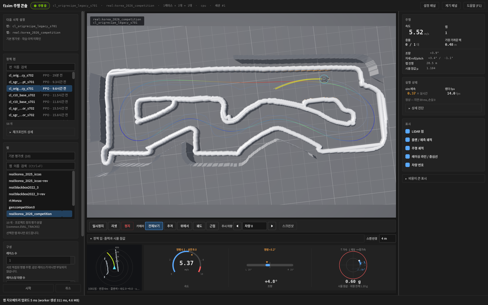
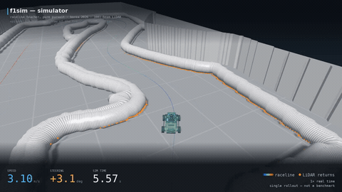
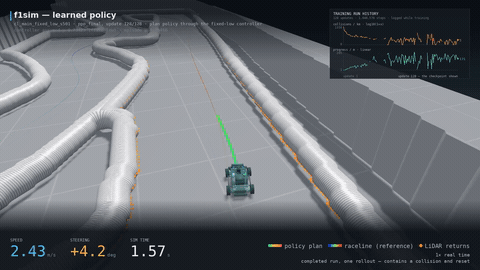
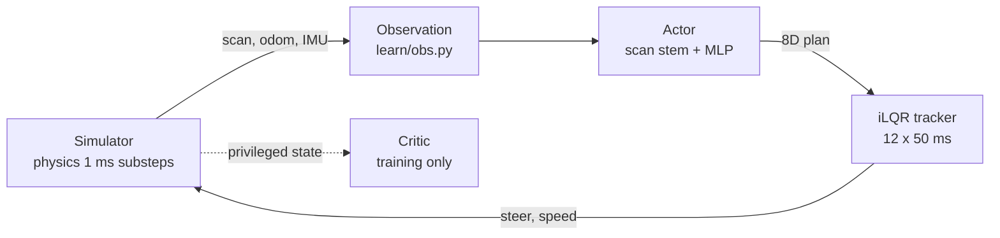

# F1TENTH_E2E

A vectorised simulator and end-to-end local planning stack for F1TENTH. It combines LiDAR, vehicle
and actuator models with DAgger/PPO training, an iLQR plan tracker, and a driving console. A ROS 2
Humble bridge integrates the simulator with the existing `f1tenth_system` stack. Several sensor and
actuator parameters are fitted to recordings from a 1:10 car.

[](docs/media/f1tenth-visualizer-overview.png)

<sub>The driving console (`python3 -m f1sim.learn.watch`) on `real:korea_2026_competition`, driven by
the frozen `ppo_race_0910` policy on the `legacy` controller path. Software-rendered on CPU —
[provenance](docs/media/PROVENANCE-visualizer.md).</sub>

A research workspace: **on-car performance of a learned policy is not established**, and no
*throughput* benchmarks are published. Driving results are published only for fixed diagnostic
scenarios, with their scope stated in each [research note](docs/research/) — see
[Status and limitations](#status-and-limitations).

## Quickstart

CPU only, no GPU and no ROS.

```bash
git clone --recurse-submodules https://github.com/shchon11/F1tenth_E2E.git
cd F1tenth_E2E
python3 -m venv .venv && source .venv/bin/activate
pip install -e f1sim
cd f1sim                      # run Python from here: the repo root has a folder that shadows
                              # the installed package -- see Troubleshooting in Getting started
```

Save as `quickstart.py` and run `python3 quickstart.py`:

```python
import torch
from f1sim import Track, Config, Simulator

cfg = Config()
cfg.sim.compile = False                      # torch.compile is a CUDA path; skip it on CPU
track = Track.generate_random(seed=0)        # or Track.from_ros_map("map.yaml")
sim = Simulator(track, cfg, num_envs=4, device="cpu")

r = sim.step(torch.zeros(4, 2))              # action = (steer [rad], target speed [m/s]) per env
print(r.scan.shape, r.odom.shape, r.state.shape)     # (4, 1081) (4, 5) (4, 7)
sim.reset(torch.nonzero(r.collision).flatten())      # partial reset re-samples the randomised parameters
```

`Config` is a dataclass tree ([`f1sim/f1sim/params.py`](f1sim/f1sim/params.py)); a step returns
`StepResult` from [`f1sim/f1sim/sim.py`](f1sim/f1sim/sim.py).

## Documentation

| | |
| --- | --- |
| [Getting started](docs/getting_started.md) | installation, CPU and GPU, the ROS 2 workspace, troubleshooting |
| [Architecture](docs/architecture.md) | simulator fidelity, maps, raceline and teacher, the viewer |
| [Training](docs/training.md) | DAgger, PPO, evaluation, the console, observation and action detail |
| [Benchmark](docs/benchmark.md) | the checkpoint leaderboard CLI — suite, roster pinning, scoring, metrics |
| [Leaderboard](docs/leaderboard/README.md) | the rendered checkpoint leaderboard — per-cohort tables, exact counts, evidence and method |
| [ROS 2](docs/ros2.md) | launch files, topic contracts, teleoperation |
| [Research notes](docs/research/) | dated experiment reports with protocol, data and scope |
| [Engineering notes](docs/README.md#engineering-notes) | algorithm assessment, simulator audit, real-data calibration |
| [로컬 실행 안내](docs/local_pc.md) | 이 워크스테이션의 실행 명령 (Korean) |

## Checkpoint leaderboard

[`docs/leaderboard/`](docs/leaderboard/README.md) renders the frozen v1 benchmark as a leaderboard:
six metrics per cohort, every percentage with the exact counts it came from, paired pace against a
reference, and a link to the evidence file behind each row. Top of the *recipe study* cohort as of
the **2026-09-12** snapshot — 7 systems, each on the same 34 scenario cells (272 trials), ranked by
solo completion. The [full leaderboard](docs/leaderboard/README.md) contains every measured system
and all six metrics:

| Rank | Checkpoint | Solo completion ↑ | Low-mu completion ↑ | Collisions/km ↓ |
| ---: | :--- | ---: | ---: | ---: |
| 1 | A recipe · seed 702 | 94.4% (136/144) | 89.6% (43/48) | 5.25 |
| 2 | A recipe · seed 701 | 93.1% (134/144) | 85.4% (41/48) | 5.60 |
| 2 | Legacy recipe · seed 501 | 93.1% (134/144) | 87.5% (42/48) | 5.52 |
| 2 | Original + surface controller (reference) | 93.1% (134/144) | 85.4% (41/48) | 6.07 |

Competition ranks inside one cohort; exactly equal values share a rank, and the two cohorts were
recorded under different benchmark source digests, so they are never ranked together. These are
candidates, not deployment promotions: low-mu is completion at the minimum declared friction rather
than friction-estimation accuracy, the maps are reused development tracks, and friction is fixed for
each episode. The [full tables](docs/leaderboard/README.md) carry all six metrics, the method and
what none of it establishes.

`docs/leaderboard/index.html` is the same report as a self-contained offline page with a cohort
switch, search, sortable columns and per-checkpoint details — download the file and open it in a
browser; GitHub does not run it. Regenerate both from measured results only:

```bash
cd f1sim
python3 -m f1sim.learn.leaderboard \
    --manifest ../docs/leaderboard/data/manifest.json --out-dir ../docs/leaderboard
```

## Requirements

| | |
| --- | --- |
| Python | ≥ 3.10 |
| Required | `numpy`, `torch`, `scipy`, `scikit-image`, `pyyaml`, `pillow`, `matplotlib`, `websockets` |
| GPU | optional — CUDA is *recommended* for large training runs and real-time multi-car simulation. Training and the estimator also run on CPU (`--device cpu`), slowly. |
| `[gym]` | `gymnasium` — the vectorised training environment |
| `[learn]` | `wandb` — experiment logging |
| `[viewer]` | `moderngl`, `glfw`, `trimesh` — the 3D viewer |
| PyQt5 | **not in any extra** — required only by the driving console; provide it yourself ([Training](docs/training.md#watching-a-run)) |
| `[dev]` | `pytest` |
| ROS 2 | optional — Humble, only for the bridge in `f1sim_ros/` |

Extras are declared in [`f1sim/pyproject.toml`](f1sim/pyproject.toml).

## The driving console

`python3 -m f1sim.learn.watch` opens the console shown above: pick a policy and a map, watch it
drive, and read what the policy was given against what the simulator actually did.

| | |
| --- | --- |
| [chase camera](docs/media/f1tenth-visualizer-chase.png) | from behind the car: LiDAR returns in orange along the duct hoses, the emitted plan, and the tracker's predicted motion |
| [policy I/O panel](docs/media/f1tenth-visualizer-policy-panel.png) | detail crop — commanded against measured speed, commanded against actual steering, and the load against the episode's true friction limit |

The images were captured on software GL without a GPU, so the frame-rate figures in them are not
performance numbers; [provenance](docs/media/PROVENANCE-visualizer.md) records the map, driver,
checkpoint hash, renderer and source hashes.

## Demonstrations

Two 25-second clips, each a single rollout rather than a benchmark. The previews below are 5-second
excerpts; click either one for the full 1920 × 1080 MP4.

| Simulator | Trained policy |
| --- | --- |
| [](docs/media/f1tenth-simulator-demo.mp4) | [](docs/media/f1tenth-learning-demo.mp4) |
| The **scripted raceline teacher** — the privileged reference driver, **not a learned policy** — on `real:korea_2026_competition`. | Playback of one completed run on the `fixed_low` controller arm. **The car hits a wall at 5.125 s and the episode resets**, marked on screen. |

Maps, checkpoints, per-episode friction, render settings and hashes are in the
[video provenance](docs/media/PROVENANCE-video.md) and [manifest](docs/media/video-manifest.json);
what the controller-arm comparisons are and where each stands is in
[Status and limitations](#status-and-limitations).

## What is simulated

The point of the fidelity is that a policy trained here should not discover an advantage that does
not exist on the car. Details and the parameter sources are in [Architecture](docs/architecture.md)
and [Real-data calibration](docs/real_data_calibration.md).

| area | modelled |
| --- | --- |
| Vehicle | single-track body with Pacejka tyres, friction circle on the driven axle, longitudinal load transfer, front/rear grip asymmetry, drag and rolling resistance |
| Suspension | sprung mass with roll and brake-dive/squat response, so the scan plane moves with the body |
| Actuators | servo lag, rate limit, trim bias and gain error; VESC speed loop with motor and traction limits; command latency |
| LiDAR | 3D beam geometry against a layered map — beams can pass over duct hoses, strike the floor under braking, and return clutter beyond the track; motion distortion across the sweep; range noise and dropouts |
| IMU | VESC 6-axis IMU at a 50 Hz sensor clock, phase-scheduled against the 40 Hz control step; gravity leakage through roll/pitch, lever arm from the CoG, speed-dependent vibration, bias and random walk, quantisation, and the VESC's own attitude estimate |
| Odometry | a model of VESC dead reckoning following `vesc_to_odom`'s formula, with calibration residuals, so it drifts |
| Maps | duct hoses, tall clutter and room walls, floor, unknown space — procedural layouts and SLAM maps of real venues |
| Randomisation | a configured set of named ranges in `RandomizationConfig`, re-sampled per environment on reset — **not** every numeric parameter. Some, such as `vehicle.mu_r_scale`, are fixed. |

## Data and action contracts

Control runs at 40 Hz. The LiDAR shares that rate; the IMU runs at 50 Hz and is delivered on its own
schedule, so a step carries one or two samples depending on the phase.



The privileged path is dashed because it exists only during training: the critic sees simulator
state that the car cannot measure, and the actor never does.

**Observation** — shapes are **per environment** and depend on `EnvConfig`; the values below are the
defaults. Every field is available on the real car. Integrated pose is deliberately excluded, because
it drifts and its drift statistics differ between simulation and reality.

| key | shape | meaning |
| --- | --- | --- |
| `scan` | `(k, 1081)` | `k` stacked LiDAR scans, `scan_stride` control steps apart, normalised |
| `speed` | `(1,)` | VESC speed estimate |
| `imu` | `(6,)` | step-mean gyro and accelerometer, normalised |
| `imu_att` | `(2,)` | VESC roll/pitch estimate |
| `prev_action` | `(action_history · act_dim)` | previous **normalised** actions; `action_history` defaults to 2 (so 16 with the 8D plan) |
| `speed_cap` | `(1,)` | the current curriculum cap |
| `hist` | `(hist_len · (9 + act_dim))` | optional proprioceptive history: speed (1), IMU (6), roll/pitch (2) and the action; 17 per row with the 8D plan |

The project is often described as LiDAR-only. That is accurate about *exteroception* — there is no
camera, no map and no localisation — but the policy does receive proprioception. The intent of
including it is to make the car's own grip and lag *inferable* from what it felt and was told,
rather than forcing a policy to drive for the worst case in the randomisation. Whether a trained
policy actually exploits that is a separate question, and it is not established here.

**Action** — two layers, which are easy to confuse:

- `Simulator.step` takes **raw physical 2D commands**: `(steer [rad], target speed [m/s])`. That is
  what the quickstart passes.
- `F1VecEnv.step` takes **normalised actions in [-1, 1]**, either 2D (`direct`) or 8D (`plan`),
  and converts them — through the tracker in `plan` mode — into the physical command above.

`EnvConfig(action_mode=...)`:

| mode | action | tracked by |
| --- | --- | --- |
| `direct` | `(steer, target speed)` at 40 Hz | — |
| `plan` | **8 numbers**: 6 curvature knots along the next stretch of travel, plus 2 speed heads — the **start and end speed targets of the local plan** | iLQR on a kinematic bicycle with understeer, 12 × 50 ms ([`mpc.py`](f1sim/f1sim/mpc.py)) |

The two speed heads are interpolated **along arc length**, not time: the reference speed at a point
is `v0 + (v1 - v0) · s/S` for that point's distance `s` along the plan of length `S`. Separately,
`PlanSpec.v_cmd_lead` (0.15 s) is the lookahead at which `PlanTracker` reads its *predicted* speed to
form the command — it is not a deadline by which `v0` is reached. Some docstrings still describe an
older 4-knot, time-referenced design; the implementation is what is written here.

`plan` makes the policy a local planner in the car's own frame, so no pose is needed and the same
tracker code runs on the vehicle. Curvature is used rather than `y(x)` because a hairpin is simply a
large curvature, where a polynomial in `x` cannot bend back.

## Workflows

Each is one command here and a section in the linked page.

| | inspect the interface | page |
| --- | --- | --- |
| Driving console (PyQt5) | `python3 -m f1sim.learn.watch` | [Training](docs/training.md#watching-a-run) |
| Legacy GL viewer | `python3 f1sim/scripts/demo_viewer.py --seed 1 --cars 8` | [Architecture](docs/architecture.md#viewer) |
| Imitate a teacher | `python3 -m f1sim.learn.dagger --help` | [Training](docs/training.md#dagger) |
| Reinforcement learning | `python3 -m f1sim.learn.ppo --help` | [Training](docs/training.md#ppo) |
| Evaluate a checkpoint | `python3 -m f1sim.learn.evaluate --help` | [Training](docs/training.md#evaluation) |
| Benchmark checkpoints against each other | `python3 -m f1sim.learn.benchmark plan` | [Benchmark](docs/benchmark.md), [measured subset](docs/research/benchmark-v1-2026-09-12.md) |
| Render the leaderboard from measured results | `python3 -m f1sim.learn.leaderboard --help` | [Leaderboard](docs/leaderboard/README.md) |
| Drive the ROS 2 stack | `ros2 launch f1sim_ros f1tenth_stack_sim.launch.py map:=gen:competition:3` | [ROS 2](docs/ros2.md) |

The training rows are `--help` on purpose. **The defaults are not a starting point**: `ppo` defaults
to `--envs 2048` and `--total 100e6`, so running it bare begins a multi-day job on a large GPU.
[Training](docs/training.md) gives bounded recipes that finish. These `python -m` invocations work
from the repository root; plain `import f1sim` there does not — see
[Getting started](docs/getting_started.md#a-directory-shadowing-trap).

## Repository map

| path | contents |
| --- | --- |
| [`f1sim/`](f1sim/) | the simulator package (`pip install -e f1sim`), ROS-independent, `COLCON_IGNORE`d |
| `f1sim/f1sim/` | `sim.py`, `dynamics.py`, `lidar.py`, `imu.py`, `odom.py`, `actuators.py`, `randomization.py`, `track.py`, `maps.py`, `mpc.py`, `raceline.py`, `teacher.py`, `gym_env.py`, `params.py` |
| `f1sim/f1sim/learn/` | observation encoding, model, DAgger, PPO, evaluation, export, the watch tool |
| `f1sim/f1sim/viewer/` | OpenGL viewer (`native.py`, `gl_scene.py`) and the optional browser monitor |
| [`f1sim/tests/`](f1sim/tests/) | the test suite |
| [`f1sim/scripts/`](f1sim/scripts/) | viewer demo, map and car-model generation, galleries, benchmarks |
| [`f1sim_ros/`](f1sim_ros/) | ROS 2 bridge: launch files, `vesc_sim` node, policy node, config, sample maps |
| [`external/`](external/) | pinned third-party submodules — see [Third-party components](#third-party-components) |
| [`docs/`](docs/) | documentation and figures |

## Status and limitations

Read this section before treating any number in this repository as a result.

**Working and exercised.** The simulator, the map catalogue, the raceline and teacher, the plan
action space with its iLQR tracker, the training loops (DAgger and PPO), evaluation, the viewer, and
the ROS 2 bridge against the unmodified `f1tenth_system` stack.

**In progress.** The plan tracker can run under four controller variants — `legacy` (no explicit
friction limit, and the default), `fixed_low`, `oracle` and `estimated`. Two separate comparisons
exist, and they answer different questions:

- a **frozen-actor grid** across all four arms, which holds one policy fixed and varies only the
  controller. That grid has been run.
- a **matched-policy comparison** of `fixed_low` against `estimated`, three seeds each, where the
  actor trains under its own arm. Complete: 72 cells, 1152 trials —
  [research note](docs/research/2026-09-11-controller-arm-evaluation.md).

**What that evaluation found.** `estimated` completes 87.85 % against `fixed_low`'s 84.38 %, but the
three training seeds disagree on the sign and the seed spread (~10–11 pp) is wider than the gap, so
there is **no robust method-level completion gain**. Among trials both arms complete, `estimated` is
faster in all three seeds by 0.12–0.23 s. Separately, **both** arms fall well short of the frozen
actor at the lowest friction. That is an observation about the outcome of fine-tuning under these
controllers; its **cause is not established**, and a one-seed `legacy`-recipe probe did not settle it
([follow-up](docs/research/2026-09-11-legacy-recipe-probe.md)).

The arms, and the fact that the default loaders refuse a checkpoint trained under a non-`legacy` one,
are in [Training](docs/training.md#experimental-friction-aware-control).

**Training-recipe screen: no recipe met the selection criteria.** Four
recipes × two seeds, each 128 updates / 1 048 576 steps, evaluated on 30 fixed cells / 240 trials per
checkpoint at a static friction coefficient per episode. **No recipe was eligible**: the best reached
+1.875 pp mean low-friction gain against a required ≥ 2 pp. The criteria were fixed before the final
selection and before the outcomes were inspected; the threshold was not changed and no recipe was
selected. For every recipe the two training seeds also **disagree in sign** at low friction, so these
runs give **insufficient evidence of a robust method-level benefit**. These are engineering
eligibility gates, not a significance or power analysis
([research note](docs/research/static-grip-retention-2026-09-12.md), with per-trial data and the
independent eligibility audit beside it).

**Not established.**

- On-car performance of a learned policy is not established, and sim-to-real transfer is untested.
  That is separate from parameter calibration, several parameters of which *are* fitted to vehicle
  recordings.
- No *throughput* benchmarks are published here; measure on your own hardware with
  [`scripts/benchmark.py`](f1sim/scripts/benchmark.py). Driving results are published only for the
  fixed diagnostic scenarios in the [research notes](docs/research/), with their scope stated there.
- No trained checkpoints are distributed with the repository.
- Generalisation to unseen venues, obstacle placements or opponent behaviour has not been
  established. The published evaluation uses diagnostic maps that appear in the original actor's
  recorded training exposure, so it is not an unseen-venue result.
- Parts of the real-car system identification are still open — servo time constant, VESC
  acceleration limits, tyre peak slip — so those randomisation ranges are informed estimates. Others
  (IMU noise and bias, LiDAR extrinsics, calibration gains) are fitted to recordings; see
  [Real-data calibration](docs/real_data_calibration.md).

## Testing

```bash
cd f1sim && python3 -m pytest tests -q
```

The suite covers LiDAR geometry against analytic values, 3D beam behaviour over obstacles, noise and
dropout statistics, motion distortion, vehicle dynamics at the limit, actuator and latency timing,
odometry drift, IMU specific-force and attitude behaviour, and the vectorised environment's
auto-reset semantics. Most tests run on CPU.

## Third-party components

`external/` contains submodules pinned to the commits this work was developed against. They are
not vendored copies and keep their own licences.

| submodule | upstream |
| --- | --- |
| `f1tenth_system` | https://github.com/f1tenth/f1tenth_system |
| `f1tenth_gym` | https://github.com/f1tenth/f1tenth_gym |
| `f1tenth_racetracks` | https://github.com/f1tenth/f1tenth_racetracks |
| `f1tenth_maps` | https://github.com/CPS-TUWien/f1tenth_maps |
| `f1tenth-racing-stack-ICRA22` | https://github.com/zzjun725/f1tenth-racing-stack-ICRA22 |
| `diagnostics` | https://github.com/ros/diagnostics |
| `korea_teams/*` | Korean F1TENTH team repositories, used as map sources |

Initialise them with `git submodule update --init --recursive` if the clone omitted
`--recurse-submodules`. Some must be hidden from `colcon`; see
[Getting started](docs/getting_started.md#ros-2-workspace).

This repository does not currently carry a licence file, so no licence is stated here. The
third-party components under `external/` are governed by their own.
