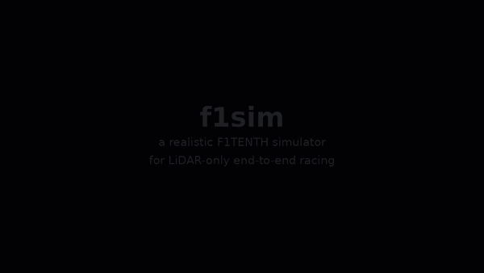

# F1TENTH e2e planner workspace

<p align="center">
  
  <br/>
  <sub>viewer footage, 30 s (<a href="docs/promo.mp4">mp4</a>): ppo_v3 chase cam with scan saliency and activations, the plan action space on the Korea championship map (trajectory coloured by speed, iLQR tracker), 256 cars of ppo_v4 training, a race against teacher cars. <code>f1sim/scripts/promo_video.py</code>, headless.</sub>
</p>


Goal: a realistic, fast F1TENTH simulator (ROS 2 Humble) for training an end-to-end
LiDAR-only planner (RL and/or IL) and deploying it on the real car (Hokuyo 1080-beam 2D
LiDAR, VESC, Jetson AGX).

```
F1tenth/                 ROS 2 workspace (build/ install/ log/ src/)
src/
  f1sim/        ROS-independent GPU-vectorized simulator core (pip package, COLCON_IGNORE)
    f1sim/sim.py, dynamics.py, lidar.py, odom.py, actuators.py, randomization.py, track.py
    f1sim/raceline.py   min-curvature raceline + friction-limited speed profile
    f1sim/teacher.py    privileged pure-pursuit teacher on the raceline (IL teacher / RL baseline)
    f1sim/gym_env.py    vectorized Gymnasium-style env (LiDAR-only obs, progress reward)
    f1sim/viewer/native.py, gl_scene.py   native OpenGL viewer (moderngl), in-process
    f1sim/viewer/server.py + static/      optional browser monitor over WebSocket (remote training jobs)
    f1sim/assets/       procedural F1TENTH car model (GLB), scripts/make_car_model.py
  f1sim_ros/    ROS 2 bridge: one env in real time with the real car's topics
  external/     f1tenth_system (humble-devel, vesc + ackermann_mux + f1tenth_stack), f1tenth_racetracks,
                f1tenth_gym maps, ros/diagnostics (only diagnostic_updater is built)
  docs/         screenshots
```

## Getting the code
`~/F1tenth/src` is a git repository (initialized 2026-09-07); the third-party stacks and map
collections under `external/` are submodules pinned to the commits this work was done against.
```bash
git clone --recurse-submodules <url> ~/F1tenth/src      # or: git submodule update --init --recursive
bash ~/F1tenth/src/external/setup_colcon_ignore.sh        # colcon must not build vesc_driver, teleop_tools, gym, maps ...
pip install -e ~/F1tenth/src/f1sim && cd ~/F1tenth && colcon build --symlink-install
```
Ignored on purpose: `__pycache__`, `*.egg-info`, W&B folders, checkpoints (`*.pt`, `*.onnx`, they live
in `~/f1sim_runs`) and the rendered videos in `docs/` (re-render with `f1sim.learn.watch`).

## Why not f1tenth_gym
| f1tenth_gym | f1sim |
|---|---|
| single-track, linear tires | single-track + Pacejka tires, friction circle on the driven axle, longitudinal load transfer, front/rear grip asymmetry (understeer at the limit), drag + rolling resistance |
| instant actuators | servo first-order lag + rate limit + trim bias + gain error; VESC speed loop with motor/traction limits; command latency (10 to 80 ms) |
| ideal 2D ray-cast LiDAR | 3D beam geometry on a layered map: the scan plane follows body roll/pitch (suspension model) and mounting misalignment, so beams hit the floor under braking dive, pass over the duct hoses on the inside of a corner and return clutter/room walls outside the track; motion distortion across the sweep; real-Hokuyo-like tiny range noise, near-zero dropouts |
| walls only | map layers: duct hoses (low, height 0.2 m), tall objects (room walls, clutter, unknown space), floor; procedural tracks generate a room with random clutter; SLAM maps are classified duct-shell / floor / tall |
| rigid body | sprung mass: roll ~0.1 rad/g, brake dive / squat ~0.09 rad/g, 2.8 Hz / zeta 0.35 second-order response (all randomized) |
| no IMU | VESC built-in 6-axis IMU (`f1sim/imu.py`): specific force at the sensor with gravity leaking in through roll/pitch and the lever arm from the CoG, speed-proportional vibration at wheel / 2x wheel / motor frequencies + broadband, sensor low-pass, 100 Hz sampling (2 samples per 40 Hz step), bias + random walk, white noise, 16-bit quantization, misalignment, and the VESC's own Mahony-style attitude estimate that bends under sustained acceleration |
| perfect odometry | VESC dead-reckoning exactly like `vesc_to_odom` (ERPM speed + commanded steering), calibration residuals, drifts realistically (~5 %/lap nominal) |
| collision = episode end | terminate, or soft wall contact (slide/stop against the wall) |
| fixed params | every numeric parameter randomized per env on reset (`RandomizationConfig`; ranges for a small car with a fast servo on venue floors: mu 0.7-1.1, command delay 5-30 ms, servo 20-60 ms, mass +-10 %, tire stiffness +-20 %, steer/speed gain +-8 %; the earlier extremes (mu 0.55, 100 ms) only taught caution) |
| LiDAR returns everywhere | glossy hall floor: a floor hit at grazing incidence gives no return (20-95 % at grazing, fading out by 6-20 deg); a duct hose seen edge-on drops returns (0-70 %); hose diameter x0.7-1.3 per env; other cars are porous boxes |
| unknown = wall | SLAM maps: unknown space within 2 m of the lane is floor for the LiDAR (a beam over the hose sees floor, then something tall), solid for collisions; duct hoses 33 cm laid in segments with 15-35 cm gaps (procedural tracks, 0.12 gaps/m), banner-board fences 1-3 m out on 60 % of venues |
| ~numpy, 1 env | torch + Triton, thousands of envs on one GPU |

## Install
```bash
pip install -e src/f1sim        # core (torch already installed; triton optional but used on CUDA)
cd ~/F1tenth && colcon build --symlink-install     # f1sim_ros + vesc_msgs/vesc_ackermann/ackermann_mux/f1tenth_stack
```

## Core usage
```python
import torch
from f1sim import Track, Config, Simulator
track = Track.generate_random(seed=0)             # or Track.from_ros_map("map.yaml")
sim = Simulator(track, Config(), num_envs=1024, device="cuda")
r = sim.step(torch.zeros(1024, 2))               # action = (steer [rad], speed [m/s]) per env
r.scan, r.odom, r.state, r.collision, r.progress  # see f1sim/sim.py:StepResult
sim.reset(torch.nonzero(r.collision).flatten())   # partial reset re-samples randomized params
```
Config is a dataclass tree (`f1sim/params.py`) and can be loaded from yaml (`Config.from_yaml`).

## Maps
`f1sim/maps.py` is the catalog; every entry loads into the same layered `Track`:
* `gen:competition:<seed>`: indoor event layouts. The outline of a random blob of cells on a
  coarse grid (pitch = lane spacing 2.5-3.3 m) becomes the centerline: long straights, 90 deg
  corners rounded to arcs, hairpins at one-cell peninsulas, folded sections with two lanes
  separated only by the duct hose, width 1.6-2.4 m varying, room walls + clutter.
* `gen:hallway:<seed>`: building corridor loops with 90 deg corners and jogs, tall walls, unknown
  space behind them, bins along the walls (Levine-style venues).
* `gen:circuit:<seed>`: smooth wide loops (the original generator).
* `rt:<Name>`: f1tenth_racetracks (Spielberg, Monza, Silverstone, ... 1:10 scale real circuits
  with centerlines), loaded from `src/external/f1tenth_racetracks`.
* `gym:<name>`: f1tenth_gym maps (levine, stata_basement = real SLAM hallways with tall walls;
  berlin, skirk, vegas = drawn tracks with duct boundaries).
* `real:<name>`: SLAM maps of real physical venues collected from public repos: `icra2022` (the
  ICRA 2022 F1TENTH Grand Prix track, from a competitor's stack), `blackbox2021_1..3` and
  `blackbox2022_1..3` (TU Wien BlackBox races),
  `korea_2025_iccas` (4th F1TENTH Korea Championship 2025 at ICCAS, KORA team SLAM map; loaded
  with the SLAM clean-up: only the hall's free region is kept -- a 0.15 m opening cuts the leaks
  through which scan rays sprayed out of the gaps -- floating specks are dropped and the unseen
  interiors of the hoses count as hose. The rectangular outline is the outer duct hose of a track
  built inside a bigger hall, so beyond it the LiDAR sees floor for 5 m; `outer_walls=True` exists
  for maps whose outline really is a wall; `Track.from_ros_map(keep_region=True, ...)`). Practice
  tracks of Korean teams and the CTU Prague `plechaty` venue are deliberately not in the catalog
  (not competition layouts). The Korea championship organizers publish no map files
  (tracks are built on site and mapped by the teams; the orientation decks only show a venue photo:
  large dark duct hoses on ballroom carpet, banner boards around). `docs/real_venues.png`.
* any ROS map yaml. Maps without a centerline get one automatically: the drivable region of a loop
  is an annulus, and the curve equidistant from its outer boundary and its infield is extracted as
  a contour (`Track.centerline_from_free_space`, cached under `~/.cache/f1sim/centerlines`).
* lane obstacles: `gen:competition:5+obs` / `real:icra2022+obs2` drop 1-4 tall boxes into the lane
  against one side (>= 1.2 m passage left), like the static obstacles of the competitions.
A `Simulator` / `F1VecEnv` takes a list of tracks: every env has a track id, distance fields
are batched on the GPU (fp16 for big sets), and the gym env re-draws a random track for each
new episode (`maps.random_set(n)` for a procedural mix). `docs/map_grid.png`, `docs/map_zoo.png`.

## Raceline + teacher
```python
from f1sim.raceline import Raceline
from f1sim.teacher import RacelineTeacher
rl = Raceline.build(track)                       # 3-10 s per track; Raceline.build_cached caches on disk
teacher = RacelineTeacher(rl, wheelbase=0.3302, device=sim.device)
cmd = teacher(sim.state, sim.P)                  # privileged: compensates latency/servo lag/grip
```
Raceline: iterated bounded least squares on the *exact* discrete curvature (denominator
included), the line re-sampled uniformly and the widths re-measured on the map after every
Gauss-Newton step, box-QP solved with L-BFGS-B (scipy's lsq_linear/trf stops at 2-3x the optimal
cost on these systems). The first version linearized the curvature with the centerline spacing
and never re-parametrized, which rewards bunching points on the inside of corners: it produced
V-shaped apexes with 3x the curvature of the centerline, and every teacher/DAgger result before
2026-09-07 used those lines. Safety: 0.40 m free space to the boundary (0.25 x (lane - car) on
narrow lanes, at least 0.12 m), soft curvature cap ~1.1 1/m (the car's full-lock radius is
0.74 m), side widths capped at 0.8 x the median lane width so side rooms of SLAM maps do not
pull the line off the lane. `docs/racelines.png` (`scripts/raceline_gallery.py`).
Teacher: pure pursuit with understeer compensation (effective wheelbase L + 0.003 v^2, measured
on the simulated car: 20 % less yaw than kinematic at 4 m/s^2 lateral, 35 % at 6) plus the
privileged latency/servo/calibration/grip compensation; a Stanley + feed-forward mode exists
but loses under randomized delays. Speed-profile defaults stay conservative (rear-axle-only
VESC braking ~3 m/s^2, lateral 6 m/s^2). On the 26-track train+eval set at a 6 m/s cap, 8 envs
per track for 15 s: 0.09 collisions per env without randomization, 0.13 with (worst: the
narrow corridor section of blackbox2021_3). `scripts/eval_teacher.py` renders `docs/raceline_*.png`.

## Gym-style vector env (training interface)
```python
from f1sim.gym_env import F1VecEnv, EnvConfig
env = F1VecEnv(track, Config(), EnvConfig(scan_stack=2, scan_subsample=4), num_envs=1024, device="cuda")
obs, info = env.reset(seed=0)                    # obs: scan (k, N) in [0,1], speed, prev_action; info["priv"] for critics
obs, rew, term, trunc, info = env.step(action)   # action in [-1,1]^2; auto-reset, info["final"] on episode end
```
Observation keys: `scan` (k stacked scans, `scan_stride` control steps apart: 3 x stride 3 =
175 ms of history for velocity cues), `speed` (VESC), `prev_action`, `imu` (step-mean gyro xyz /
accel xyz, normalized), `imu_att` (VESC roll/pitch estimate), and optionally `hist`
(`hist_len` rows of speed / imu / roll-pitch / action, `hist_stride` steps apart: the last second
of what the car felt and was told, so the actor can identify its own grip and lag instead of
driving for the worst car in the randomization -- the critic sees those parameters directly). Reward = progress [m] - 10 on
collision (PPO runs use 50-150, optionally plus a term per m/s of impact speed so a fast crash
costs more than a nudge) - 0.05 * |steer change| - 0.1 * wall proximity (under a 0.30 m gap) - 0.2 while facing
backwards along the lane (progress is signed, so driving the wrong way already pays negative reward;
this makes it explicit). Everything the
policy sees is available on the real car; integrated pose/odometry is deliberately excluded (it
drifts, and its drift statistics differ between sim and real).

Action spaces (`EnvConfig(action_mode=...)`): `"direct"` = (steer, speed) at 40 Hz;
`"plan"` = the policy is a *local planner*: 4 curvature knots along the next 0.7 s of travel
(1.5-6 m of arc, linear in between, integrated into a path that leaves the car straight ahead --
curvature, not y(x): a hairpin is just a large curvature, a polynomial in x cannot bend back and
strayed up to 0.8 m from the raceline) plus the target speed 0.15 s ahead and at the end of the
plan (6 numbers, all in the car's own frame, no pose needed), tracked by an iLQR on a kinematic
bicycle with understeer, 12 x 50 ms, calibrated latency, IMU yaw rate as the initial turning
state (`f1sim/mpc.py`, CUDA-graph compiled: 16 ms for 2048 envs). The teacher becomes a planner
too (`RacelineTeacher.plan_action`: the knots start from what pure pursuit would do to rejoin
the line, blended into the raceline's curvature ahead, and Gauss-Newton refines them through the
raceline points 0.4-1.0 L_p ahead with a ridge back to that guess -- a fit that was free to snap
back at full lock crashed on every rejoin, one that was too soft drifted off; residual 0.05-0.2 m),
so DAgger imitates plans and PPO refines them; the tracker is the same code on the real car:
`f1sim/mpc_fast.py` is `mpc.solve` for one car as scalar loops compiled with Numba (0.012 ms per
control step on a laptop core; the torch version is 19,000 tiny ops = 10 ms, which would not fit
the Jetson's 25 ms budget), checked against the torch solver to 1e-6 and against the training
env step by step (`tests/test_mpc_fast.py`, `tests/test_plan_node_parity.py`). The policy node uses
it when `numba` imports and falls back to the torch tracker otherwise.
The teacher's speed profile is computed per grip level (12 profiles per raceline, corner speeds
and braking points scale with the car's friction, never above the nominal profile) and it slows
down when off the line. Under full randomization on the training set at a 6 m/s cap it now
crashes 0.21 times per car per 20 s through the tracker, the direct pure-pursuit teacher 0.24. The viewer
draws the focus car's plan coloured by its speed profile (blue slow -> yellow fast), the
tracker's predicted motion, and a dash with a speedometer and a steering wheel.

Races (`EnvConfig(race_size=M, opponent="teacher"|"policy")`): consecutive envs form races of M
cars on one track instance. Other cars appear in the LiDAR as what a scan plane at ~15 cm
really meets: the electronics deck / LiDAR tower (12-24 cm), the chassis plate and the four
wheels only when the plane tilts down onto them (3-12 cm / 0-11 cm), each part with its own
porosity (wheels 35 %, deck 10 %), sizes scaled per car, plus the small cardboard detection box
the rules require on the rear bumper (6-11 cm deep, 13-22 cm wide, 8-12 to 22-30 cm high,
solid: 0-5 % dropout, drawn translucent in the viewer), hit type 4; car-car contact
(separating-axis test on the footprints including the rear boxes) is a collision for both. Cars spawn staggered 2.5-6 m apart; a crashed car respawns behind its race mates, the
leader's time limit resets the whole race onto a new track. `opponent="teacher"`: cars 1..M-1
follow the raceline teacher at a random 0.6-1.0 speed scale (overtaking practice), only car 0's
transitions train (`env.learner`); `"policy"`: every car is driven by the caller (self-play).
The critic additionally sees the nearest opponent (body-frame offset, closing speed, distance).
`docs/multicar_lidar.png`.

## 3D viewer (native, instead of RViz)
```bash
python3 src/f1sim/scripts/demo_viewer.py --seed 1 --cars 8          # opens a window, GPU sim paced to real time
python3 src/f1sim/scripts/demo_viewer.py --map track.yaml --cars 1
python3 src/f1sim/scripts/demo_viewer.py --headless-shots out/      # EGL offscreen screenshots (servers, CI)
python3 src/f1sim/scripts/demo_viewer.py --web                      # browser monitor on :8765 instead
```
```python
from f1sim.viewer.native import NativeViewer
sim.warmup()                                     # JIT-compile kernels first (10-20 s) so the window never stalls
v = NativeViewer(sim, raceline=rl)               # glfw window; headless=True for EGL offscreen
v.run(step_fn)                                   # paced loop with interpolation, or:
r = sim.step(a); v.update(r); v.render()         # drive it yourself
```
moderngl renderer in the simulator process: instanced car meshes (up to 64 cars), directional
shadow map, corrugated duct hoses along the map contours, tall clutter/walls, floor grid,
raceline colored by target speed, LiDAR hit points colored by what they hit (orange duct,
magenta object outside the track, cyan floor), car body rolls/pitches on its suspension while
the wheels stay on the floor, steering/rolling wheels, HUD with roll/pitch/speed/lap.
1.5 ms/frame for 8 cars on the RTX 5060. Keys: `C` camera (chase / top / orbit / overview /
closeup), `[` `]` focus car, `L` lidar, `V` raceline, `T` trails, `P` pause, `S` screenshot,
mouse drag = orbit, wheel = zoom (driving keys W/S/A/D/Shift/Space/R are free for manual mode).

Troubleshooting: a black window with the HUD missing means the GL frames are not presented.
On this laptop that was caused by `__NV_PRIME_RENDER_OFFLOAD=1` / `__GLX_VENDOR_LIBRARY_NAME=nvidia`
exported by `~/fsk/src/scripts/fsk-shellrc` while NVIDIA is already the primary GPU
(`prime-select query` = nvidia); every GLX app is affected, not only f1sim. The viewer now drops
those variables automatically in that configuration (`F1SIM_KEEP_PRIME_ENV=1` overrides).

Car model (`scripts/make_car_model.py`, ~48k faces): Traxxas Slash 4x4 proportions, treaded
short-course tires with split-spoke rims, LCG tub chassis, shock towers with oil shocks
(springs, blue caps), A-arms, camber links, drive shafts, front bumper with foam, nerf bars,
motor + spur cover, LiPo with strap, VESC 6 with heatsink, standoffs, laser-cut upper platform,
Jetson AGX dev kit, power board, USB hub, antenna, Hokuyo UST-10LX (orange band), cabling.
Nodes `wheel_*` / `lidar` are pivots; geometry names carry a material class
(rubber/plastic/metal/blue/glass/paint/pcb) that the renderer maps to shading parameters.

## ROS 2: f1tenth_system (RoboRacer / F1TENTH) stack on the simulator
`src/external/f1tenth_system` (humble-devel) is built in this workspace (vesc_msgs,
vesc_ackermann, ackermann_mux, f1tenth_stack; vesc_driver/urg_node/teleop are COLCON_IGNOREd,
diagnostic_updater comes from ros/diagnostics). The simulator replaces only the hardware
drivers: `f1sim_ros/vesc_sim_node.py` speaks vesc_driver's and urg_node's interface, so the
rest of the stack runs unchanged with its own config files:
```bash
ros2 launch f1sim_ros f1tenth_stack_sim.launch.py map:=gen:competition:3      # viewer window included
ros2 launch f1sim_ros f1tenth_stack_sim.launch.py map:=rt:Spielberg viewer:=false publish_gt_tf:=false
ros2 topic pub -r 40 /drive ackermann_msgs/msg/AckermannDriveStamped "{drive: {steering_angle: 0.1, speed: 2.0}}"
```
| topic | type | who |
|---|---|---|
| `/drive`, `/teleop` -> `/ackermann_cmd` | AckermannDriveStamped | ackermann_mux (stack) |
| `/commands/motor/speed` (ERPM), `/commands/servo/position` (0..1) | Float64 | ackermann_to_vesc (stack) -> **vesc_sim** |
| `/sensors/core` (ERPM, tacho, V, A), `/sensors/servo_position_command` | VescStateStamped, Float64 | **vesc_sim** -> vesc_to_odom (stack) |
| `/odom` + tf odom->base_link | Odometry | vesc_to_odom (stack), from the sim's telemetry |
| `/sensors/imu`, `/sensors/imu/raw` | VescImuStamped, Imu | **vesc_sim** |
| `/scan` (frame laser) | LaserScan | **vesc_sim**; static tf base_link->laser 0.27 0 0.11 as in bringup |
| `/ego_racecar/odom`, `/map`, `/f1sim/collision`, tf map->odom | sim-only ground truth (disable map->odom when running a localizer) |
The same `vesc.yaml` (speed_to_erpm_gain 4614, servo gain -1.2135 / offset 0.5304, servo/speed
limits) is read by vesc_sim, so calibration errors between the stack's numbers and the "true"
car live in the sim's randomized actuator/odometry parameters, exactly where they are on the
real car. `f1sim_ros/config/vesc.yaml` is the stack's file with wheelbase 0.3302.

## Manual driving (racing-game feel)
`f1sim/teleop.py` turns pedals + stick into the car's (steering, target speed) command with the
dynamics of a racing game: throttle is *acceleration* (2 m/s^2 at full pedal with a soft pedal
curve, capped at 5 m/s; Shift/LB boost doubles the push and lifts the cap to 8; `teleop_a_throttle:=`
and `teleop_v_max:=` to taste), releasing everything coasts down like engine braking, brake is strong,
holding the brake at standstill engages reverse, throttle brakes while reversing, the target
never runs more than 2.5 m/s ahead of the measured speed (wall contact / blocked), steering
lock shrinks with speed (full lock below 2.5 m/s, 35 % at 7+ m/s) with slew-rate limits, and
keyboard keys are ramped into analog values so digital input feels like a stick. Gamepads get a
deadzone + gamma curve and analog triggers.

* In the simulator window: `ros2 launch f1sim_ros f1tenth_stack_sim.launch.py map:=gen:competition:3`
  and drive with W/S, A/D or arrows, Shift boost, Space handbrake, R reset. The window publishes
  `/teleop`, which goes through ackermann_mux -> ackermann_to_vesc -> the (simulated) VESC like a
  real joystick; the mux hands back to `/drive` when you stop touching the keys.
* Gamepad (real car or sim): `... joy:=true joy_preset:=xbox` (left stick steer, RT/LT pedals,
  LB boost, A handbrake) or `joy_preset:=f1tenth` (the stack's F710 D-mode mapping: left stick Y
  speed, right stick X steer, hold LB to drive, hold RB for autonomous).
  Standalone: `ros2 run f1sim_ros teleop --ros-args -p preset:=xbox` or `-p keyboard:=true` in a terminal.
* Without ROS: `python3 src/f1sim/scripts/demo_viewer.py --manual` (you drive car 0, the others follow the teacher).

## ROS 2 bridge (standalone, gym_ros-style)
```bash
source install/setup.zsh
ros2 launch f1sim_ros sim.launch.py                       # random track, rviz
ros2 launch f1sim_ros sim.launch.py map_yaml:=/abs/path/map.yaml device:=cuda
ros2 topic pub -r 40 /drive ackermann_msgs/msg/AckermannDriveStamped "{drive: {steering_angle: 0.1, speed: 2.0}}"
```
Topics: `/drive` in; `/scan` (laser), `/odom` (odom->base_link, drifting VESC odom),
`/ego_racecar/odom` (map, ground truth), `/sensors/imu` + `/sensors/imu/raw` (VESC IMU, as
vesc_driver publishes them), `/map`, `/f1sim/collision` out; `/initialpose` teleports;
`/f1sim/reset` service. TF: map->odom->base_link->laser. A policy node written against
these topics runs unchanged on the real car.

Sample maps with centerlines: `f1sim_ros/maps/` (regenerate with `src/f1sim/scripts/make_maps.py`).
Real track maps: put the SLAM map yaml/pgm and, optionally, `<name>_centerline.csv`
(f1tenth_racetracks format) next to it.

## Validation (tests/)
* LiDAR ranges vs analytic circle: max error < 1.5 cells, Triton kernel == torch tracer
* 3D beams: floor hit range under pitch/roll equals the analytic value, a beam tilted up passes
  over the 0.2 m duct and returns the wall behind it, tilted down hits the floor before the duct
* noise / dropout statistics match the configured values
* motion distortion shifts early beams, leaves the last beam exact
* straight-line speed tracking, low-speed yaw rate == kinematic bicycle
* limit cornering: lateral accel saturates below mu*g, understeers instead of spinning
* full lock + full throttle stays finite; soft wall contact stops the car without blow-up
* command latency + servo lag timing
* full laps on random tracks without collision, progress integrates to one lap length
* odometry drifts, but plausibly

* gym env: shapes, auto-reset semantics, teacher gets positive return / finishes laps
* IMU: specific-force formula (gravity, lever arm), rest reads (0,0,g), brake dive makes the
  accelerometer over-read, cornering gyro/lateral match, vibration grows with speed, attitude
  filter converges at rest and bends under acceleration, per-env bias randomization

Run: `cd src/f1sim && python3 -m pytest tests -q`

## Throughput (RTX 5060 Laptop, 25 ms control step, 1 ms physics, 1080 beams)
| envs | ms / step | env-steps / s |
|---|---|---|
| 1 | 2.8 | 360 |
| 1024 | 3.5 | 292,000 |
| 4096 | 11.6 | 352,000 |
CPU, 1 env, eager: ~30 ms/step (the 3D LiDAR + suspension made the CPU path heavier), so the
ROS bridge should run on the GPU (4 ms/step, launch default `device:=cuda`); on CPU it publishes
at ~32 Hz instead of 40.

## Training (`f1sim/learn/`)
Decisions: LiDAR-only e2e with proprioception (VESC speed, IMU step-mean, VESC roll/pitch estimate,
last 2 actions, speed cap); reward = centerline progress - 10 * collision - 0.05 * |steer change|
- 0.1 * proximity (linear ramp once the body-to-wall gap is under 0.30 m: a mild safety margin,
hugging the hose on the racing line is still allowed); speed cap
curriculum 4 -> 8 m/s; train tracks = `common.TRAIN_TRACKS` (user-curated: 6 real competition
SLAM maps + rt:Spielberg/Oschersleben + 2 gen:competition seeds, each in both lap directions and
mirrored via the `~rev` / `~mir` modifiers, plus the 6 real maps with static box obstacles
(`+obs<seed>`, one box per ~35 m of lane, all four variants). ppo_v10 trains on that 60-track
set (`--tracks train_v10`); from ppo_v11 five more community SLAM maps (berlin, columbia_small,
torino_small, mtl, porto: 11 real base layouts) and the pocket variants make it 144 tracks
(`--tracks train`).
Mirroring came in after ppo_v9, which had been trained on the 8 unmirrored layouts: deterministic,
20 s per car, 6 m/s cap, it crashed 0.05/car on its training layouts, 0.36 on their mirror images
(teacher 0.06) and 0.23 on the held-out maps (teacher 0.01) -- memorized layouts, not geometry.
Its final checkpoint (120M steps, cap 8) sat at 0.35 mirrored / 0.28 held-out: more training on
the same layouts did not transfer at all. ppo_v10 continues from it on the mirrored set and by
update 200 had the mirrored layouts at 0.18 (seen 0.04) -- but held-out stayed at 0.30, and a crash
map showed why: 44 of its 46 held-out crashes were on blackbox2022_3, in that hall's dead-end
alcoves and side rooms, slow (2 m/s where the raceline runs 4) and from a comfortable gap: the policy
follows an opening that looks like the track and stops at its end. Korea, Monza and gen:0 were at
0.06 or below. Hence `+pk<seed>`: `Track.with_pockets` carves 3-8 walled dead-end side pockets
(0.8-2.4 m wide, 1-4 m deep, duct-hose walls: pit-lane mouths, alcoves, side corridors) into a map;
the lane, centerline and raceline (built on the unmodified `base` track) are untouched, so the
teacher never enters one. 60 % of them open on the outside of a bend: a crash map of ppo_v11 at
update 100 showed that this is the configuration that traps the policy (all 12 crashes on
icra2022+pk0~mir were in the one pocket straight ahead of a corner; pockets beside a straight are
ignored), and it is what blackbox2022_3's side corridors are. Half of them turn 90 degrees after
their first leg, so their end is out of sight from the mouth, as in a real side corridor: the
policy cannot learn "enter only if no end wall is visible". From ppo_v11 every real map trains
plain, with boxes and with pockets; ppo_v12 = the same run restarted from ppo_v11's checkpoint with
the bend-biased pockets. ppo_v11 starts
from ppo_v10's update 300, which on its own 60 tracks is at teacher level (seen 0.02, mirrored 0.07
at a 6 m/s cap; teacher 0.04) and on held-out 0.28 = blackbox2022_3 1.00 / 0.56, everything else
at most 0.06.
Held-out eval = `common.EVAL_TRACKS` (real:korea_2025_iccas and
real:blackbox2022_3 both ways, rt:Monza, gen:competition:0); `--tracks` takes `train`, `eval` or a
comma separated catalog list; W&B project `f1sim-e2e`; runs and checkpoints under
`~/f1sim_runs/<name>/`. Track galleries: `docs/tracks_*.png` (`scripts/track_gallery.py`).
```bash
cd src/f1sim
python3 -m f1sim.learn.dagger --name dagger_v1 --envs 1024 --iters 8 --steps 250                # teacher -> student, ~10 min
python3 -m f1sim.learn.ppo --name ppo_v1 --init ~/f1sim_runs/dagger_v1/student_latest.pt --envs 2048 --total 100e6
python3 -m f1sim.learn.evaluate ~/f1sim_runs/ppo_v1/ppo_latest.pt --sweep          # held-out tracks + mu/latency/lidar-height sweeps
python3 -m f1sim.learn.evaluate --teacher                                            # the baseline to beat
python3 -m f1sim.learn.export ~/f1sim_runs/ppo_v1/ppo_latest.pt --trt               # ONNX (+ TensorRT) for the Jetson
# races: fine-tune a single-car policy against teacher-driven opponents (only car 0 learns), then self-play
python3 -m f1sim.learn.ppo --name ppo_race --init ~/f1sim_runs/ppo_v4/ppo_final.pt --race-size 3 --opponent teacher --scan-stride 3 --kl-coef 0
python3 -m f1sim.learn.ppo --name ppo_selfplay --init ~/f1sim_runs/ppo_race/ppo_final.pt --race-size 3 --opponent policy --scan-stride 3 --kl-coef 0
ros2 launch f1sim_ros f1tenth_stack_sim.launch.py map:=gen:competition:2 policy:=$HOME/f1sim_runs/ppo_v1/ppo_latest.pt policy_speed_cap:=5.0
```
* `obs.py`: the one observation encoding, used by the gym env and by the ROS policy node.
* `model.py`: 1D-conv scan stem + MLP actor (Gaussian, tanh mean), separate critic with the
  privileged vector (true velocities, track-relative pose, wall clearance, randomized params).
* `dagger.py`: teacher drives / student drives with teacher labels, aggregated buffer, Huber loss.
* `ppo.py`: asymmetric-critic PPO from the DAgger student, KL-to-imitation regularizer that decays,
  value clipping, speed-cap curriculum, per-episode metrics (collision rate, progress, lap time).
* `policy_node.py` (f1sim_ros): /scan + /odom + /sensors/imu -> /drive, same ObsBuilder; the
  launch's `policy:=` argument starts it against the simulated stack.

### Watching training (`f1sim.learn.watch`)
```bash
python3 -m f1sim.learn.watch --run ~/f1sim_runs/ppo_v3 --map gen:competition:2 --cars 128        # window, reloads ppo_latest.pt as it changes
python3 -m f1sim.learn.watch --run ~/f1sim_runs/ppo_v2/ppo_final.pt --cars 256 --record out.mp4  # headless recording (ffmpeg)
python3 -m f1sim.learn.watch                                                                      # no arguments: launcher window
```
The launcher window picks the run (newest by default), map, cars, cap, opponents, GPU for the
window, and has "save a video instead of opening a window": a headless 30 fps mp4 of the chosen
length into `~/f1sim_runs/videos/`, named after the run, map and time. On the command line the
same is `--record out.mp4 --seconds 20 --fps 30`; `--frames dir/` writes PNGs instead and
`--highlights dir/ --episodes N` records the best car of each of N episodes.
Runs its own simulator with N agents on the latest checkpoint of a training run (auto-reload), so
training is not slowed by rendering. On screen: the focus car's LiDAR points colored by saliency
(red = beams the policy's action depends on most), the 256 hidden units and 256 scan features as
heat grids, action mean/std gauges, the critic's value estimate, checkpoint step count. `[` `]` change
the focus car. `docs/watch_ppo_v2.mp4` is a 10 s recording of 128 agents on the v2 policy.

Best-of-episode replays (`--episodes N`): every agent's states and scans are recorded for a full
episode, agents are ranked (clean runs first, then progress), and the winner is replayed from the
recording with chase camera, saliency, the network panel and a leaderboard. In a window the loop
is live episode -> replay -> next episode; headless, `--highlights DIR` writes one mp4 per episode:
```bash
python3 -m f1sim.learn.watch --run ~/f1sim_runs/ppo_v3 --cars 128 --episodes 5 --episode-s 40 --replay-top 2
python3 -m f1sim.learn.watch --run ~/f1sim_runs/ppo_v2/ppo_final.pt --cars 64 --episodes 3 --highlights out/   # headless mp4s
```
`docs/highlight_ppo_v2_ep1.mp4`: best of 64 agents, 20 s episode.

### Results so far (2026-09-07, W&B project f1sim-e2e)
| run | setup | held-out competition tracks (cap 6 m/s, 60 s episodes) |
|---|---|---|
| teacher | raceline pure pursuit, privileged | laps 25-32 s, collisions 0-1 % |
| dagger_v1 | 2M samples, 8 iterations | 22 % collisions at 93 % of the teacher's pace |
| ppo_v1 | penalty 10, gamma 0.99, 52M steps | laps 15-16 s, collisions 40-57 % (plateau) |
| ppo_v2 | penalty 50, gamma 0.995, cap 4->8 over 60M, 100M steps | laps 15-16 s, collisions 18-37 %; hallway 54 %; ONNX 2 MB, 2-4 ms inference in the ROS node, drives the simulated stack |

Lessons: with 40 s episodes the progress reward (~+160) dwarfs a -10 collision penalty, so v1 learned
to crash; -50 with gamma 0.995 halved the collision rate at the same lap times. All procedural
generators traced their loops counter-clockwise, so v1/v2 only ever saw left-turning tracks (visible
as low progress on Spielberg); odd seeds are now mirrored (`Track.mirrored`). Next: retrain with
mirrored tracks, more DAgger epochs, longer PPO with a higher hallway share.

## Decisions so far
* e2e LiDAR-only policy is the goal (localization-free, opponent interaction, research). Classic
  stack (map + localization + raceline) is the teacher/baseline, not the deliverable.
* Plan: single-car first. Teacher (done) -> DAgger distillation into the LiDAR student ->
  PPO fine-tuning with asymmetric critic -> add opponents (multi-car sim + self-play).

## Open items
* DAgger + PPO training scripts, student network (1D conv over scan stack), TensorRT export
* multi-car: opponents in the LiDAR scan, car-car collisions, self-play
* real-car system identification: measure servo tau, VESC accel limits, actual latency, tire peak
  slip and feed them into `Config` and the randomization ranges
* maps of the real track(s) + centerlines
