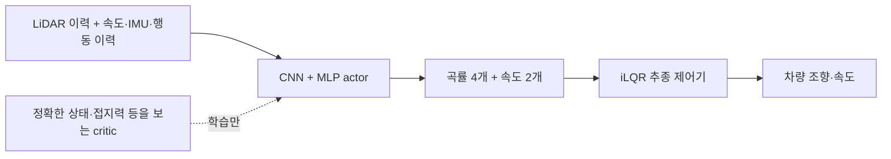

# F1TENTH planner 알고리즘 평가

평가일: 2026-09-07. 목표: 지도·전역 위치추정에 의존하지 않는 actor가 처음 보는 트랙, 정적 장애물과 상대 차량에 대응하며 빠르고 안정적으로 주행한다.

## 판단

**현재는 대회 성능이 검증되지 않은 학습 기반 local planner 연구 시스템이다.** 센서→짧은 경로·속도→추종 제어기의 분리는 유지할 가치가 있다. 현재 모델의 일반화, 완주율, 추월 능력과 실차 전이를 입증하는 고정 조건의 평가가 부족하다. DAgger→PPO라는 알고리즘 이름 자체가 현재 병목이라는 증거는 없다.

이번 검토는 코드, 작은 재현 실험, 실제 시뮬레이터 주행을 근거로 한다. 로컬 `setup_4060ti_*` 체크포인트는 세팅 검증용이며 학습된 레이싱 정책의 비교군으로 사용하지 않았다. 과거 W&B 실행은 서로 다른 teacher·환경·속도 상한을 사용했고, 최근 학습/평가 오류 수정 이전 기록이다.

## 현재 구조와 적합도



| 부분 | 확인된 구현 | 판단 |
|---|---|---|
| Actor 입력 | LiDAR·차량 센서·이전 행동, 전역 pose 입력 없음 | 유지. localization-free 목표와 맞음 |
| 출력 | 차체 좌표계의 곡률 4개와 속도 2개 | 유지. 작은 행동 공간, 경로를 직접 점검 가능 |
| 추종기 | 차량 모델 기반 iLQR, 조향/가속도 제한 | 유지하되 충돌 방지 기능과 구분해야 함 |
| DAgger | 학생이 방문한 상태에서 privileged raceline teacher의 답 수집 | 단독 주행의 초기 정책에 적합 |
| PPO | 비대칭 critic, 모방 정책 KL, 속도 curriculum | 계속 사용 가능. 성능 평가는 수정된 계산으로 다시 해야 함 |
| 정적 장애물 | 장애물 포함 맵과 그 맵의 raceline 생성 | 구현됨. 배치 일반화는 별도 검증 필요 |
| 동적 상대 | LiDAR 반사·차량 충돌·teacher opponents·동일 정책 self-play | 시뮬레이터 기능은 있음. 학습된 추월 능력은 미검증 |

근거: [관측](../f1sim/f1sim/learn/obs.py), [신경망](../f1sim/f1sim/learn/model.py), [teacher](../f1sim/f1sim/teacher.py), [추종기](../f1sim/f1sim/mpc.py), [환경](../f1sim/f1sim/gym_env.py).

## 주요 구조적 한계

### 시간 정보

기본 LiDAR 3프레임·stride 1·40Hz의 첫 프레임과 마지막 프레임 간격은 **50ms**다. stride 3이면 150ms다. `hist_len=20, hist_stride=2`는 약 950ms 간격의 proprioception 이력을 포함하지만 LiDAR 이력은 늘리지 않는다. 현재 actor는 feedforward CNN+MLP다.

짧은 스캔 이력으로 상대 운동을 추정할 수는 있다. 가림이 오래 지속되거나 동일한 현재 관측에 다른 접근 이력이 필요한 경우까지 처리한다고 볼 근거는 없다. 긴 스캔 이력/GRU 비교는 동적 상대 단계의 우선 실험이다. 데이터·계산 오류가 남은 상태에서 큰 신경망으로 교체하는 것은 원인 분리를 어렵게 한다.

### Teacher가 아는 정보와 학생이 아는 정보

Teacher는 전역 raceline, 트랙 위치, 정확한 grip 정보를 사용한다. 장애물이 있는 맵에서는 장애물에 맞춰 생성된 raceline의 영향을 받으므로 정적 장애물을 전혀 모르는 teacher라고 해석하면 안 된다.

하지만 `plan_action`은 현재 상대 차량의 상태나 스캔을 받지 않는다. 현재 DAgger teacher는 반응형 추월·양보의 정답 제공자가 아니다. 또한 보이지 않는 코너/접지력 차이 때문에 비슷한 학생 관측에 다른 teacher 답이 필요할 수 있다. 이런 정보 부족은 학습량만 늘려도 해결된다고 보장할 수 없다.

### 계획의 추종 가능성과 충돌 회피

`mpc.py`의 iLQR 비용은 경로 추종·제어 노력·명령 변화량을 다룬다. 스캔, 장애물 예측, swept-body 충돌 제약이나 마찰 한계를 입력받지 않는다. 따라서 반환된 제어 명령은 안전성 증명이나 충돌 없는 경로의 보장이 아니다.

PPO의 plan-clearance 보상은 차체 예상 경로가 벽에서 0.15m 안으로 들어올 때만 적용한다. 벽에 가까운 racing line 자체를 금지하는 제약이 아니며, 0.15m 밖의 경로에는 비용이 없다.

계획은 약 0.7초 이동 거리(1.5–6m), 추종 예측은 12×50ms다. 이 길이가 충분한지는 제동 능력·속도·가시거리로 시험해야 한다. 곡률과 속도가 각각 범위 안에 있다는 것만으로 동시에 실현 가능한 조합이 되는 것은 아니다.

실차 단계에서는 경로의 차량 폭·예상 충돌·제동 여유 점검과 명령 watchdog을 추가해야 한다. 제약을 넣은 뒤에도 같은 조건에서 실제 차량으로 검증해야 한다.

### 평가와 실험 이력

기존 canonical 평가에는 상대 차량과 별도 장애물 배치 평가가 없었다. DAgger의 `collision_rate`는 시작 에피소드 기준, PPO 학습 로그는 종료 에피소드 기준이다. 기존 평균 랩타임은 완주한 구간에만 조건부이며, 시작 위치부터 첫 finish crossing까지의 부분 랩 처리에도 오류가 있었다.

환경 랜덤화 범위, teacher, 입력 이력과 보상 설정을 동시에 변경한 과거 실행을 단일 변경의 효과로 해석하지 않는다. 동일 체크포인트도 현재 simulator 기본값으로 재평가하면 과거와 다른 문제를 풀게 된다. 이번 JSON 평가 결과에는 실제 사용한 simulator/env 설정을 저장한다. 체크포인트의 완전한 optimizer/RNG 재개는 아직 구현된 기능이 아니다.

## 이번에 확인하고 수정한 기반 문제

| 문제 | 근거 | 변경 |
|---|---|---|
| PPO 행동 확률 불일치 | 앞선 세팅 작업에서 가중치 고정 상태의 확률비 오류 재현 | 제한 전 행동과 확률을 저장하는 기존 수정 유지 |
| 종료 후 상태 혼합 | 새 위치/속도와 이전 lateral·진행량·IMU가 섞이는 CPU 재현 | terminal critic 입력을 보존하고 현재 reset 상태를 일관되게 구성 |
| Time-limit value target | 최종 다음 상태 대신 현재 상태의 value를 사용 | `final_obs`와 대응하는 `final_priv`로 bootstrap |
| Curriculum 기록 소실 | 로그를 쓰면 recent collision 기록도 삭제 | 별도 500개 bounded history 사용 |
| 부분 랩이 첫 랩타임에 포함 | crossing 100/200 step에서 2.5초 대신 5초 | 첫 crossing부터 시작 시각 기록 |
| Procedural obstacle seed 무시 | `+obs1`과 `+obs99` occupancy가 동일 | 배치 seed를 실제 생성에 사용 |
| `True`가 장애물 1개로 해석 | bool이 int인 Python 동작으로 항상 1개 요청 | bool 랜덤 개수와 명시적 정수 개수 구분 |
| 완주 여부를 판단하기 어려운 평가 | 시작/종료 분모 차이와 auto-reset 재시도 혼합 | 첫 시도만 집계하는 `--protocol trials` 추가 |

장애물 생성 수정으로 **같은 이름의 procedural `+obs` 맵도 이전 코드와 배치가 달라질 수 있다.** 과거 결과와 비교하려면 해당 코드 버전/맵도 함께 고정해야 한다. 목표 트랙과 물리 설정 자체를 더 쉽게 만들지는 않았다.

## 새 평가의 의미

`--protocol trials`는 처음 시작한 각 learner의 첫 시도 하나만 센다. 시작 지점과 무관하게 **초기 트랙 한 바퀴 길이 이상의 signed progress**를 충돌 없이 누적해야 성공이다. finish line을 짧게 지나간 것만으로는 성공 처리하지 않는다. 충돌/성공/시간 종료 뒤의 auto-reset 재시도는 점수에 들어가지 않는다.

결과는 성공·충돌·timeout 수와 비율, 활동 차량 시간, 주행 거리, 충돌/km, 성공 시도 시간 분포를 포함한다. 성공 시간은 무작위 시작 지점 기준이므로 고정 finish-line 랩타임과 구분한다. `--protocol rolling`은 기존 지속 주행 평가용이다.

`--race-size 2 --opponent teacher`는 상대가 있는 관측과 충돌을 평가한다. 현재 상대는 자동 재생성되는 교통이며 learner는 기본적으로 앞에 출발한다. 이 점수는 엄격한 무재생성 경기 결과나 추월 성공률이 아니다. 초기 앞차 배치, 상대 제동/방어 행동과 추월 판정은 후속 시나리오 실험이 필요하다.

```bash
source /home/shchon11/F1tenth/activate.sh

python -m f1sim.learn.evaluate --teacher --action-mode plan \
  --tracks eval --per-track --protocol trials --seed 123 \
  --envs 8 --steps 2400 --speed-cap 4 \
  --output algorithm-audit/teacher-heldout.json

python -m f1sim.learn.evaluate --teacher --action-mode plan \
  --tracks eval_obstacles --per-track --protocol trials --seed 123 \
  --envs 8 --steps 2400 --speed-cap 4 \
  --output algorithm-audit/teacher-obstacles.json

python -m f1sim.learn.evaluate /path/to/trained/ppo_final.pt \
  --tracks gen:competition:0 --protocol trials --seed 123 \
  --race-size 2 --opponent teacher --envs 8 --steps 2400 --speed-cap 4 \
  --output algorithm-audit/policy-traffic.json
```

`eval_obstacles`는 Korea, BlackBox2022_3, procedural seed 0에 별도 장애물 seed 101/102/103을 적용한 양방향 6개 항목이다. 대회용 성능 판정에는 위 작은 8-trial 예시보다 많은 반복이 필요하다.

## 이번 실제 실행 결과

수정된 코드, plan teacher, 속도 상한 4m/s, 기본 randomization, seed 123, 첫 시도당 최대 60초:

| 트랙 | 완료 / 초기 시도 | 충돌 | timeout | 성공한 한 바퀴 거리 주행 평균 시간 |
|---|---:|---:|---:|---:|
| `real:korea_2025_iccas` | 8 / 8 | 0 | 0 | 12.96초 |
| `gen:competition:0+obs101` | 8 / 8 | 0 | 0 | 20.85초 |

이는 **teacher + tracker 기준선**이며 학생 일반화 결과가 아니다. 각 8회·단일 seed만으로 신뢰성을 확정하지 않는다. 출발 위치가 무작위이므로 고정 finish-line 랩타임과도 구분한다. 원본 설정·계수·거리·시간은 `algorithm-audit/teacher-trials.json`에 있다.

추가로 `gen:competition:0`, 두 차량/레이스, 느린 teacher 상대, 총 8개 환경의 **learner 첫 시도 4/4 완료**, 충돌 0, 평균 20.52초를 확인했다. `algorithm-audit/teacher-traffic-trials.json`에 기록했다. learner가 앞에 출발하는 teacher baseline이고 추월 횟수를 측정하지 않으므로, 추월 능력을 입증하는 결과는 아니다.

- 통합 회귀: 22개 통과. reset, GAE, curriculum, lap, first-attempt 지표, 장애물 생성 및 기존 learning/gym 동작 포함.
- 평가 metadata를 rolling/trials별로 구분한 최종 수정 후 평가 테스트 8개 통과.
- 별도 장애물/트랙 수정 테스트: 5개 통과. 변경 전 장애물 관련 두 회귀 테스트가 실패하는 것을 먼저 확인했다.
- 실제 PPO 실행: 4개 CPU 환경, horizon 8, 64 step, episode timeout 0.1초로 반복 truncation을 통과하고 체크포인트 저장. 학습 성능 실험이 아니다.
- 오류 중심 Ruff, compileall 및 diff 검사를 사용했다. Python LSP/typecheck 서버는 이 환경에 설치되어 있지 않아 전체 정적 타입 검증을 수행하지 못했다.
- 독립 수정 검토는 bounded delta PASS. 대회 준비도/실차 경계의 FAIL 판정은 유지한다.

## 다음 결정에 필요한 실험

1. **Teacher→DAgger→PPO 동일 조건 비교.** 동일한 simulator 코드·차량 설정·맵·seed·속도 상한으로 각 모델을 평가한다. 먼저 4m/s에서 완료율과 충돌/km를 비교한다. Teacher도 실패하는 상황과 학생만 실패하는 상황을 분리한다.
2. **시간 정보 ablation.** 현재 actor와 더 긴 LiDAR 이력, 작은 GRU를 동일 데이터/학습 예산에서 비교한다. DAgger replay가 stride를 정확히 재구성하도록 구현한 뒤 시험한다. 가림·접근·급제동이 있는 상대 시나리오가 필요하다.
3. **추월 학습 분리.** 단독 주행 정책을 고정된 여러 상대 정책과 비교하고, 따라가기·추월·추월 포기의 성공/충돌을 측정한다. 동일 정책 self-play만으로 상대 다양성을 확보했다고 간주하지 않는다.
4. **실차 전이 조기 확인.** 측정한 지연·조향·제동·센서 통계로 simulator 조건을 고정하고 저속 시험부터 비교한다. 현재 simulator의 truth 기반 calibration+작은 잔차 가정이 실측과 맞는지 확인한다.

목표 완료율의 예시로 트랙별 100회 이상·여러 seed에서 99%를 설정할 수 있으나, 이는 앞으로 정할 공학적 목표이며 달성 결과가 아니다. 100회 무충돌조차 드문 실패 확률을 엄밀히 보장하지는 않는다. 속도 증가는 완료율과 실패 패턴을 확인한 뒤 한 단계씩 적용한다.

## 실차 투입 전 남은 항목

[policy_node.py](../f1sim_ros/f1sim_ros/policy_node.py)는 오래된/없는 odom·scan, 지연된 inference 결과를 거르는 충분한 freshness 검사가 없다. disable/shutdown 시 정지 명령을 보장하지 않고, mux의 입력 timeout을 실제 하드웨어 제동 watchdog과 동일시할 수 없다. 배포 시 체크포인트 actor의 완전한 일치와 calibration 유효성 검사도 필요하다. 이 항목들은 소스 검토 결과이며 이번에 실차로 재현하거나 해결한 것으로 보고하지 않는다.

별도 웹 뷰어의 파일 경로 containment와 bind 범위에도 기존 문제가 확인됐다. 기본 native viewer 주행 경로와는 분리된 항목이며 외부 공개 전 수정이 필요하다.

## 검토 판정

| 관점 | 검토 당시 판정 | 의미 |
|---|---|---|
| 목표 적합도 | 준비도 FAIL | 구조는 유지 가능, 신뢰할 대회 성능 근거 부족 |
| 주행 QA | 제한된 smoke PASS / 목표 INCONCLUSIVE | 20초 teacher 주행 무충돌, 완주·추월 입증 아님 |
| 학습 계산 | FAIL → 이번 수정 및 회귀 검증 대상 | reset/GAE/curriculum/lap 오류 |
| 실차 경계 | FAIL | 센서 freshness·정지 보장 등 남음 |
| 설계 맥락 | INCONCLUSIVE | 조건이 바뀐 과거 결과로 현재 일반화를 입증할 수 없음 |

따라서 이번 작업 완료를 대회용 시스템 승인으로 해석하지 않는다. 실행 증거는 `/home/shchon11/F1tenth/algorithm-audit/`에 보존한다.

참고 연구: [RaceMOP](https://arxiv.org/abs/2403.07129), [End2Race](https://arxiv.org/abs/2509.16894), [DRL 구조별 F1TENTH 비교](https://f1tenth.github.io/publications/deep_reinforcement_learning.pdf). 첫 두 연구의 주요 추월 결과는 시뮬레이션이며 현재 구현의 성능 보증은 아니다.

## 2026-09-07 generalization 실험

학생이 직선에서도 불안정하다는 viewer 관찰을 계기로 plan·direct·시간 구조를 비교했다.

- 기존 CNN plan: 직선 곡률 변화 평균 0.0091, 실제 normalized 조향 변화 0.0301.
- hard residual plan: 각각 0.0062, 0.0235로 줄었지만 DAgger 복구 성능이 악화되어 폐기했다.
- temporal loss: 실제 조향 변화가 약 10% 줄었지만 직선 plan 변화와 충돌률 개선이 없어 폐기했다.
- direct control: 실제 조향 변화 0.0373이고 DAgger 충돌률도 plan보다 나빠 주력 구조에서 제외했다.
- fixed-window GRU: 직선 plan 변화 0.0050, 실제 조향 변화 0.0216으로 안정적이었으나 같은 학습 단계의 충돌률이 CNN보다 높았다. 실험 옵션은 남기고 주력 checkpoint에는 사용하지 않았다.

teacher는 Korea 동일 seed 16/16 완료, spin 0이었다. 초기 plan 학생은 14/16 완료, spin 3, wrong-way 시간 20.9%였다. 32트랙 PPO `u300`은 16/16, spin 0까지 개선되어 wrong-way 보상이 실제 스핀 감소에 작동함을 확인했다.

remote 최신 `d9795bb`의 mirror 증강을 반영한 60트랙 DAgger는 BlackBox2022_3 양방향을 4/32만 완료했다. 이후 28개의 독립 procedural geometry를 추가하고 환경/배치를 두 배로 늘린 112트랙 DAgger는 학습 평가 충돌률 0.118까지 내려갔지만 BlackBox는 여전히 4/32였다. 따라서 단순 geometry 수와 mirror 증강만으로 일반화 병목이 해결되지 않았다.

112트랙 학생에 5M PPO를 적용했다. 보상은 progress, 충돌 -150, 충돌 속도당 -20, 이동거리 기준 proximity 0.5, wrong-way 0.2, 차체 계획이 벽 0.15m 안으로 들어갈 때 초당 plan-clearance 2를 사용했다. 두 held-out seed의 총 192회 결과는 완료 91, 충돌 70, timeout 31, spin 37이었다. BlackBox 완료는 8/64에 그쳤다. plan-clearance는 spin을 줄였지만 처음 보는 구조의 완주 일반화는 만들지 못했다.

현재 보상 체계는 안전 PPO의 출발점으로 타당하다. progress는 속도와 방향, collision과 collision-speed는 사고, wrong-way는 스핀, proximity와 plan-clearance는 실제·예상 벽 여유를 각각 다룬다. 벽 가까운 racing line을 금지하지 않도록 plan-clearance는 차체 여유 0.15m 안에서만 작동한다. 다음 병목은 보상 계수보다 privileged raceline teacher가 학생에게 보이지 않는 미래를 정답으로 제공하는 관측 불일치다.

다음 실험은 teacher label의 관측 가능성을 측정하고, 전역 raceline 미래 대신 LiDAR 가시거리와 제동거리 안에서 정의되는 mapless local teacher 또는 더 작은 compact plan 표현을 비교하는 것이다. BlackBox를 학습에 넣어 통과시키는 것은 일반화 검증이 아니므로 하지 않는다.

W&B: [112트랙 DAgger](https://wandb.ai/shchon11-hanyang-university/f1sim-e2e/runs/wfxv909a), [plan-clearance PPO](https://wandb.ai/shchon11-hanyang-university/f1sim-e2e/runs/gcftncwf).
