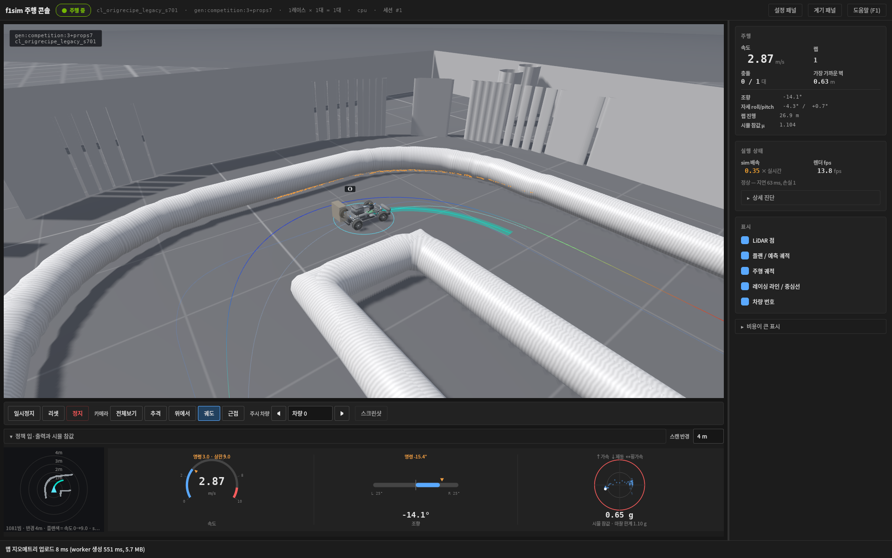

# Architecture

How the simulator is put together and why each part is modelled the way it is. Parameter sources are
in [Real-data calibration](real_data_calibration.md); known weaknesses are in
[Simulator audit](simulator_audit.md).

- [Timing](#timing)
- [Vehicle](#vehicle)
- [Sensors](#sensors)
- [Maps](#maps)
- [Raceline and teacher](#raceline-and-teacher)
- [Plan tracking](#plan-tracking)
- [Viewer](#viewer)

## Timing

| clock | rate | source |
| --- | --- | --- |
| Physics substep | 1 ms | `SimParams.physics_dt` |
| Control step, LiDAR | 40 Hz | `SimParams.control_rate`, `LidarParams.rate` |
| IMU | 50 Hz | `ImuParams.imu_rate` |

The IMU's 50 Hz does not divide the 40 Hz control step, so samples do not land one per step. The
sensor follows its own clock: `imu.sample_schedule` works out the exact repeating cycle, a step
carries one or two samples depending on its phase, and `StepResult.imu_offsets` records how long
before the step's end each was taken. The cost is one compiled graph per phase of the cycle, which is
why the schedule refuses rates that would need a long cycle.

An earlier version floored the ratio and delivered one sample per step, which silently turned the
50 Hz sensor into a 40 Hz one.

## Vehicle

Single-track body with Pacejka tyres and a friction circle on the driven axle. Longitudinal load
transfer shifts grip between axles under acceleration and braking; front and rear grip differ, so the
car understeers at the limit instead of spinning. Drag and rolling resistance are included.

**State layout** — `(B, 8)`, in this order:

| 0 | 1 | 2 | 3 | 4 | 5 | 6 | 7 |
| --- | --- | --- | --- | --- | --- | --- | --- |
| `x` | `y` | `yaw` | `vx` | `vy` | `yaw_rate` | `steer` | `omega_r` |

World-frame CoG pose, body-frame velocity at the CoG, the actual front wheel angle (a servo state),
and the rear-axle angular speed. `omega_r` was **appended** on 2026-09-13, never inserted, so every
`state[:, :3]` and `state[:, 3]` reader means exactly what it meant; the index constants are in
[`dynamics.py`](../f1sim/f1sim/dynamics.py) (`IX ... ISTEER, IOMEGA`) and `STATE_DIM` is the only
thing to size against.

**The rear axle can spin and lock** (`vehicle.wheel_model`). With the switch on, the longitudinal
force is a slip-ratio magic formula sharing the friction circle with `Fy_r`, the axle carries
`I_w * omega_dot = T_motor - r_w * Fx` with `T_motor = m * a_cmd * r_w`, the VESC speed loop closes
on `omega_r * r_w` rather than on the true body speed, and `odom.py` reports that same wheel speed
— so under slip the odometry is *wrong about the vehicle*, which is what makes it a slip sensor. The
car is 4WD off one motor, so `drive_split_r` divides the drivetrain's torque between the axles while
the load division moves under braking; that mismatch is the brake-lock mechanism. With the switch
off the wheel rides the body (`omega_r = vx / r_w`), the longitudinal force is set straight from the
commanded acceleration, and the simulator behaves as it did before 2026-09-13.
[`docs/research/wheel-model-2026-09-13.md`](research/wheel-model-2026-09-13.md) has the parameters,
what each is measured against, and the acceptance table versus the real recordings.

The body is sprung: roll and brake-dive/squat respond as a damped second-order system. This is not
cosmetic — it moves the LiDAR's scan plane, which is what the policy sees.

Actuators are not instantaneous. The servo has a first-order lag, a rate limit, a trim bias and a
gain error; the VESC runs a speed loop with motor and traction limits; commands arrive after a
latency. Most of these carry a randomisation range — see below — but not all of them do.

## Sensors

**LiDAR.** Hokuyo UST-10LX: 1081 beams over 270°, 10 m usable range. Nominal extrinsics are
0.297 m forward and 0.110 m up **relative to `base_link`**, read from the vehicle's `tf_static`.
Where `base_link` itself sits relative to the ground is a separate question that the TF tree alone
does not settle, so the scan-plane height above the floor is a modelling assumption, not a
measurement. Beams are cast in 3D against a
layered map rather than as a flat 2D ray-cast, so the scan plane tilting with the body changes what
returns: beams pass over a low duct hose on the inside of a corner, strike the floor under braking
dive, and see clutter or room walls beyond the track. Returns are distorted across the sweep by the
car's motion. Grazing incidence on a glossy floor and edge-on hits on a round hose both drop returns.

**IMU.** The VESC's built-in 6-axis unit, modelled at the sensor's own position and orientation:
specific force with gravity leaking in through roll and pitch, the lever arm from the centre of
gravity, speed-proportional vibration at wheel and motor frequencies plus a broadband component, a
sensor low-pass, bias and random walk, white noise, 16-bit quantisation and mounting misalignment.
A Mahony-style attitude estimate stands in for the VESC's own, including the way such a filter bends
under sustained acceleration. It is a model of that behaviour, not the firmware's algorithm. With
`vehicle.wheel_model` on there is also an impact term: a Pareto-tailed decaying impulse train fitted
to the rate at which the real accelerometer exceeds the friction bound (0.29 samples per second of
motion above mu*g, 0.02 above 50 m/s^2, peaking at 120). Without it there is nothing for a
`a_body_max`-style clamp to clamp, and a detector trained here would have no reason to have one.

**Odometry.** A model of VESC dead reckoning that follows `vesc_to_odom`'s formula — ERPM and
commanded steering — with calibration residuals, so it drifts. It reproduces the published
computation, not the firmware; the agreement is approximate and untested against the vehicle. It is
deliberately not offered to the policy. With `vehicle.wheel_model` on it carries the two artefacts
of the real ERPM channel as well: the speed is quantised onto the measured lattice
(2.3794e-4 m/s, i.e. the VESC `speed_to_erpm_gain` of 4202.7), and each sample's timestamp
(`StepResult.odom_t`) carries a publish jitter with the measured distribution. A detector trained
against a clean 40 Hz grid would fall over on the first 0.3 ms step, which is exactly the failure
`f1sim_ros/traction.py` had to be built around.

### What is randomised

`RandomizationConfig` declares a set of **named ranges** (49 entries when this was written),
re-sampled per environment on reset. That is a configured set, not "every numeric parameter":
anything without an entry keeps its nominal value in every environment. `vehicle.mu_f_scale` is randomised (0.85–1.0) while `vehicle.mu_r_scale` is fixed
at 1.0 today, so the front/rear grip asymmetry varies only through the front factor. Check
`params.py` for the current list rather than assuming a parameter is covered.

## Maps

[`maps.py`](../f1sim/f1sim/maps.py) is the catalogue; every entry loads into the same layered
`Track`, which distinguishes low duct hoses, tall objects, floor and unknown space.

| prefix | contents |
| --- | --- |
| `gen:competition:<seed>` | indoor event layouts: straights, rounded 90° corners, hairpins, folded sections separated only by hose |
| `gen:hallway:<seed>` | building corridor loops with tall walls and unknown space behind them |
| `gen:circuit:<seed>` | smooth wide loops |
| `gen:control:<seed>` | the hairpin/chicane/width family used for the current training and held-out sets |
| `rt:<Name>` | `f1tenth_racetracks` — 1:10 scale real circuits with centerlines |
| `gym:<name>` | `f1tenth_gym` maps, including real SLAM hallways |
| `real:<name>` | SLAM maps of real venues from public repositories |
| any ROS map YAML | loaded directly; a centerline is extracted automatically if absent |
| `scene:<name>` | a scene saved by the console's [environment editor](environment_editor.md) (`~/f1sim_scenes/<name>/`): duct and tall layers kept separately, props including imported meshes, centerline |

Appending `+obs<N>` rasterises static boxes into the lane, as the competitions do. `+props<N>` is
the separate, newer spelling: modelled obstacles — `cardboard_box`, `wooden_crate`, `steel_drum`,
`crate_stack_low`, `barrier_block`, `marker_post` — kept as finite convex sections rather than
stamped into the grid, so the renderer, the LiDAR and the contact test all read the same bounded
object. (`+obs` rasterises, and every checkpoint in the catalogue was trained against exactly that,
so the two are separate names rather than a redefinition.) A beam passing over a 30 cm box sees what
is behind it, which a grid-stamped obstacle could not represent — `tall` is unbounded above.

[](media/f1tenth-visualizer-props.png)

<sub>A `marker_post` on `gen:competition:3+props7`, in the driving console. That map places three
props; the other two are steel drums. Identified from the `StaticProp` placement record rather than
from the picture — [provenance](media/PROVENANCE-visualizer.md).</sub>
 A `Simulator` or
`F1VecEnv` accepts a list of tracks: each environment carries a track id, distance fields are batched
on the GPU, and the environment can draw a new track for each episode.

Real-venue maps need SLAM clean-up — keeping only the hall's free region, closing the gaps that scan
rays sprayed through, dropping floating specks, and treating the unseen interior of a hose as hose.
Where a map's outline is really the outer duct hose of a track built inside a larger hall, the LiDAR
correctly sees floor beyond it; `outer_walls=True` covers maps whose outline is a genuine wall.

## Raceline and teacher

```python
from f1sim.raceline import Raceline
from f1sim.teacher import RacelineTeacher

rl = Raceline.build(track)                       # Raceline.build_cached caches on disk
teacher = RacelineTeacher(rl, wheelbase=0.3302, device=sim.device)
cmd = teacher(sim.state, sim.P)                  # privileged: compensates latency, lag and grip
```

The raceline is a minimum-curvature line solved by iterated bounded least squares on the *exact*
discrete curvature, with the line re-sampled uniformly and widths re-measured on the map after every
Gauss-Newton step. An earlier version linearised the curvature against the centerline spacing and
never re-parametrised, which rewards bunching points on the inside of corners and produced V-shaped
apexes several times sharper than the centerline. Safety margins keep the line off the boundary and
cap curvature below the car's full-lock radius.

The teacher is pure pursuit with understeer compensation and privileged knowledge of latency, servo
lag, calibration and grip. It is a baseline and an imitation target, not the deliverable — the point
of the project is a policy that needs none of that privileged information.

## Plan tracking

In `plan` action mode the policy emits 8 numbers: 6 curvature knots along the next stretch of travel
and 2 speed heads — the start and end speed targets of that local plan.
[`mpc.py`](../f1sim/f1sim/mpc.py) integrates the knots into a path in the car's own frame and tracks
it with an iLQR on a kinematic bicycle with understeer, 12 steps of 50 ms, using the calibrated
latency and the IMU yaw rate as the initial turning state.

`mpc.reference` interpolates the two speed heads **in arc length**: the target at a reference point
`s` along a plan of length `S` is `v0 + (v1 - v0) · s/S`. `PlanSpec.v_cmd_lead` (0.15 s) is a
different quantity — the lookahead at which `PlanTracker` samples its predicted speed to issue the
command — and it is not a time by which `v0` is guaranteed to be reached.

Docstrings and older documents in this repository still describe a 4-knot, 6-number, time-referenced
plan. That design is gone; trust `N_KNOTS`, `ACT_DIM` and `reference()` in `mpc.py`.

Curvature rather than `y(x)`: a hairpin is just a large curvature, whereas a polynomial in `x` cannot
bend back on itself.

The teacher becomes a planner too (`RacelineTeacher.plan_action`), so imitation learns plans and PPO
refines them, and the same tracker code runs on the vehicle.

An experimental, opt-in extension adjusts the tracker's speed and acceleration limits from an
estimate of the current friction; see [Training](training.md#experimental-friction-aware-control).

## Viewer

Two separate front ends:

- **The driving console** (`python3 -m f1sim.learn.watch`, no arguments) is the current default. It
  is a PyQt5 application that runs the simulation in a **worker process** — importing it does not
  import torch — and it is what you want for picking a policy and a map and watching it drive.
  PyQt5 is not in the `[viewer]` extra; see [Training](training.md#watching-a-run).
- **The legacy GL viewer** below is the older in-process moderngl window, reached through
  `demo_viewer.py` and the headless recording paths. It is still the renderer the console's worker
  drives, and the keys listed here apply to it.
- The console's **환경 page** is an environment editor on the same renderer: a free camera, ground
  picking and overlays over `gl_scene.Scene`, editing a `SceneDoc` that loads as `scene:<name>`.
  See [Environment editor](environment_editor.md).

```bash
python3 f1sim/scripts/demo_viewer.py --seed 1 --cars 8        # window, paced to real time
python3 f1sim/scripts/demo_viewer.py --map rt:Spielberg --cars 1
python3 f1sim/scripts/demo_viewer.py --headless-shots out/    # EGL offscreen screenshots
python3 f1sim/scripts/demo_viewer.py --web                    # browser monitor on :8765
python3 f1sim/scripts/demo_viewer.py --manual                 # drive car 0 yourself
```

```python
from f1sim.viewer.native import NativeViewer

sim.warmup()                       # compile kernels first so the window does not stall
v = NativeViewer(sim, raceline=rl) # headless=True for EGL offscreen
v.run(step_fn)
```

A moderngl renderer inside the simulator process: instanced car meshes, a directional shadow map,
corrugated duct hoses along the map contours, tall clutter and walls, the raceline coloured by target
speed, and LiDAR hit points coloured by what they struck. The car body rolls and pitches on its
suspension while the wheels stay on the floor.

Keys: `C` cycle camera, `[` `]` change focus car, `L` LiDAR points, `V` raceline, `T` trails,
`P` pause, `S` screenshot, `M` / `N` step through tracks, `G` cycle track group, `Esc` quit. Mouse
drag orbits and the wheel zooms. The driving keys are left free for `--manual`.

The car model (`scripts/make_car_model.py`) is a procedural Traxxas-Slash-proportioned chassis with
the actual hardware on top — VESC, LiPo, Jetson AGX, Hokuyo — and geometry names carry material
classes the renderer maps to shading.
