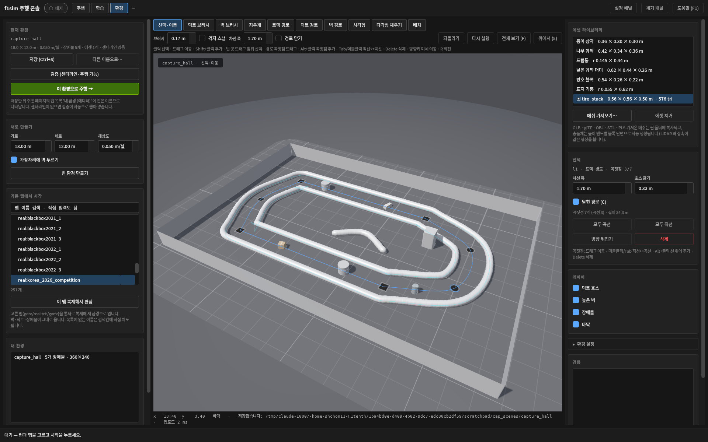
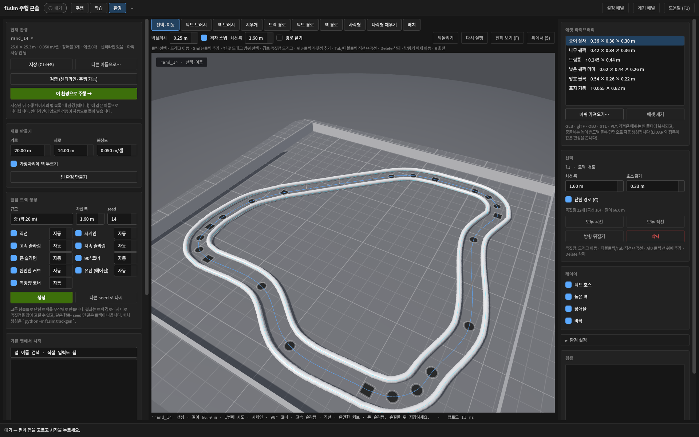
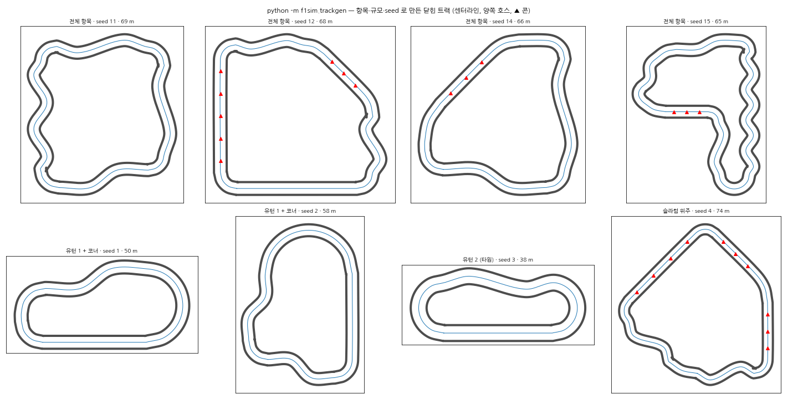

# Environment editor

**2026-09-12.** The console's third page, **환경**, builds and edits driving environments in 3D:
paint duct hoses and tall walls, draw wall polylines, place the built-in props, **import mesh
assets** (GLB / glTF / OBJ / STL / PLY) as obstacles, save the scene, validate it, and drive on it
from the 주행 page. Making a map no longer needs a generator seed, a PGM edited by hand, or a
session with someone doing it for you.

```bash
cd f1sim
python3 -m f1sim.learn.watch          # header: 주행 · 학습 · 환경
```

[](media/f1tenth-environment-editor.png)

<sub>A lane drawn as one closed **track path** — straight sides, curved hairpins — with its hoses,
a duct-path chicane, a pillar, three built-in props and two placements of an imported STL tyre
stack. The track path is selected: square handles are corner vertices, round ones are curve
vertices, the faint lines are the control polygon and the lane edges. Captured from the real console
on software GL by `work/env-editor/capture_editor.py`; the scene, placements and file hashes are in
[`media/environment-editor-manifest-2026-09-12.json`](media/environment-editor-manifest-2026-09-12.json).
The [top view](media/f1tenth-environment-editor-top.png) is taken mid-stroke: the wall brush's decal
under the cursor, and the wall already rebuilt behind it.</sub>

## What a scene is

A scene is a folder under `~/f1sim_scenes/<name>/` (root overridable with `$F1SIM_SCENES`):

```
scene.json        name, resolution, origin, duct height, centerline, paths, props, assets, notes
layers.npz        duct / tall: bool (H,W) as the simulator sees them; painted_duct / painted_tall: the brush layers
assets/           imported meshes, copied in verbatim
```

Two kinds of geometry feed the layers. **Paths** are vector objects — a list of vertices, each
straight (corner) or curved (a Catmull-Rom tangent through its neighbours), a width, open or closed —
rasterised into the grid whenever they change and editable afterwards by their handles. **Paint** is
what the brushes, the rectangle and the polygon tool leave, cell by cell. The simulator's layers are
the union; a path can never be erased by the brush, only selected and changed or deleted, and paint
never moves a path. Paint can be promoted: **칠한 덕트 → 경로** / **칠한 벽 → 경로** (환경 설정)
skeletonise the painted band, split it at junctions, simplify each chain to a few vertices (curved
where the chain bends gently, corners where it turns sharply) and replace the paint with those paths
— the way to make a brushed hose, or the hoses of an imported catalogue map, editable by handle.

`f1sim/f1sim/scene.py` owns the format (`SceneDoc`), and `maps.py` loads it as
**`scene:<name>`** — a first-class catalogue entry, so `~rev`, `~mir` and `+props<seed>` compose
with it, `--tracks scene:my_hall` trains on it, and the driving console lists every saved scene under
**내 환경 (에디터)** in its map picker. `python -m f1sim.scene export-ros <name> <dir>` writes the
ROS `map.yaml` + PGM if another stack needs it.

The layers map directly onto what the simulator can see. The LiDAR traces two distance fields —
`duct` (a hose of `duct_height`, beams pass over it) and `tall` (blocks every beam) — and props as
finite convex prisms. Nothing in the editor produces geometry outside those three kinds, which is
why a scene that looks right in the editor is what the policy is trained and evaluated against.

## Tools

| key | tool | what it does |
| --- | --- | --- |
| `V` | 선택·이동 | click a prop to select (Shift adds), drag to move (grid snap unless Alt), `R` / Ctrl+wheel rotates, `Delete` removes, Ctrl+D duplicates |
| `B` / `W` | 덕트 · 벽 브러시 | paint a duct hose / tall wall along the mouse path; one undo step per stroke. The wall brush radius is the 벽 브러시 box (Ctrl+wheel); the duct brush is always one hose wide — a duct *is* a hose of `duct_height` diameter, and the renderer stands a tube along each edge of the band, so a wider band would draw (and the LiDAR would model) two hoses side by side |
| `E` | 지우개 | clears both layers |
| `T` | 트랙 경로 | draw the **lane centreline**: click for a straight vertex, Ctrl+click for a curved one, Tab flips the last, Shift snaps to 45°, `C` closes. Commit (Enter / double-click / right-click) stands a duct hose along both edges at the 차선 폭 and makes the path the scene's centerline — no extraction step |
| `L` / `K` | 덕트 경로 · 벽 경로 | one hose (always `duct_height` wide) / one wall (`2 × brush` wide) as a path, same vertex rules |
| `M` | 사각형 | drag a rectangle of tall wall (Shift: duct) |
| `P` | 다각형 채우기 | click vertices, commit fills the polygon with tall wall (Shift+Enter: duct) |
| `A` | 배치 | put the asset chosen in the library at the click; Ctrl+wheel or `R` turns it first |

Every tool shows what it is about to do before it does it. A brush stroke is drawn as a decal in the
layer's colour under the cursor from the first pixel, and the hose or wall is rebuilt on a fixed
cadence while the button is down, so the geometry grows behind the brush. A path shows its band,
its vertices and the curve through them while you click, and a track path both hoses. The line
under the toolbar lists the keys that matter for the current tool.

Paths stay editable. In 선택·이동 a path is picked by its band and its vertices by their handles:
drag a vertex (the decal follows instantly, the raster on the next tick), Alt+click on the band to
insert a vertex, Tab or a double-click to switch a vertex between straight and curved, `C` to close
or open, Delete for a vertex or the whole path, the arrow keys to nudge. The inspector edits the
width, the hose band of a track, all-curve / all-straight, and the lane direction.

Camera: middle-drag or Alt+left orbits, right-drag or Shift+left pans on the ground, the wheel
zooms toward the cursor, `F` frames everything, `5` toggles a top-down view. Ctrl+Z / Ctrl+Y undo
and redo up to 60 steps; every edit is a snapshot of the document, so undo is exact.

The inspector on the right edits the selected prop numerically — position, heading, the style's
own dimensions (`width/depth/height`, `radius`, `scale` for meshes), its appearance seed — and
offers **벽으로 굽기**: stamp the prop's true footprint into the tall layer and remove the prop. That
is the way to turn a non-convex imported mesh into an exact wall, at the cost of the top: the grid
has no height, so a baked object blocks beams at every height.

## Assets

**메쉬 가져오기…** copies the file into the scene's `assets/` folder and reads it with trimesh:
glTF/GLB are taken as Y-up, everything else as Z-up (the asset record keeps the choice), the model
is centred on its footprint and set on the floor, and anything over 20 000 triangles is decimated
for the renderer. It then appears in the library and is placed like a built-in prop, with a `scale`
dimension.

The collision shape is derived, not authored: the LiDAR and the contact test see the **convex hull
of each of a few height bands** of the mesh (`props.sections`), the same path the built-in props
use. A drum, a cone, a tyre stack or a stack of boxes is represented tightly; an L-shaped piece
becomes its hull per band — bake it into the grid if that matters. The editor marks a prop whose
footprint overlaps a wall, and the validator refuses one the renderer cannot build, so a collider
you cannot see is not something a scene can contain.

## Random tracks from a recipe

**랜덤 트랙 생성** (left column) builds a closed track from the features you tick — 직선, 시케인,
고속/저속 슬라럼, 콘 슬라럼 between the turns; 90° 코너, 완만한 커브, 유턴(헤어핀), 역방향 코너 as the
turns — at a chosen 규모 (소/중/대), 차선 폭 and seed. A count of 자동 lets the generator pick how
many; a number fixes it. The result is an ordinary scene whose lane is one closed **track path**,
so it is immediately editable by handle, and the same features and seed always give the same track.

[](media/f1tenth-trackgen.png)

<sub>Seed 14 of the default recipe with cone slalom, slow slalom and reverse corner enabled: a
chicane, a fast slalom, a cone slalom (the posts along the top straight), two sweepers and three
corners over 66 m. Real console on software GL; [manifest](media/trackgen-manifest-2026-09-13.json).</sub>

[](media/f1tenth-trackgen-gallery.png)

<sub>Eight recipes and seeds drawn with matplotlib from the generator's output (centreline, the two
hoses, ▲ cone posts): all features; hairpin plus corners; a two-hairpin oval; a slalom-heavy lap.</sub>

How it works (`f1sim/f1sim/trackgen.py`): a lap is a ring of turns joined by runs. Turn features
are drawn until their signed angles sum to 360°; run features fill the gaps. Each run is a length
along the current heading plus a fixed lateral term (a chicane's offset), each turn a chord that
scales with its radius, so closing the loop is a linear condition on the run lengths and turn radii.
Random lengths and radii are projected onto that condition by bounded least squares (never below a
feature's minimum length or a drivable radius), the lap is rejected if it crosses or comes within a
lane plus a hose of itself, and the survivor is scaled to the requested size. Slalom amplitudes are
capped by the curvature at which the inner hoses of two bends would fold into each other.

From a shell, `python -m f1sim.trackgen --name batch --seed 100 --count 20 --size 20 --runs
straight,chicane=1,slalom_fast --turns corner,sweeper,hairpin=1` writes twenty scenes
`scene:batch_100 … scene:batch_119` for a training set; `--dry-run` prints the laps without saving.
`gen:recipe:<seed>` is the default recipe as a catalogue name, for a quick look without saving.

## Validate and drive

**검증** saves the scene and runs `python -m f1sim.scene validate` in a subprocess (this is the
one step that imports torch): it extracts a centerline from the free space when the scene has none,
checks the loop closes, measures the corridor width along it, builds every prop, and reports what it
found in the panel — click an issue to fly the camera to it. **이 환경으로 주행 →** validates, then
switches to the 주행 page with `scene:<name>` selected; press 시작 as usual. The worker loads the
scene through the ordinary map path, so a raceline is built and cached on first use like any map —
on the scene above that took about three minutes on the CPU (`validate --raceline` does it ahead of
time from a shell), after which it is cached under `~/.cache/f1sim/racelines/`.

Editing a catalogue map starts from **기존 맵에서 시작**: the same grouped picker as the driving
page (filled once the worker has listed the maps; a name can also be typed into its search box), and
**이 맵 복제해서 편집** runs `python -m f1sim.scene import <map> <name>`, copying the layers,
centerline and props into a new scene — `real:korea_2026_competition` to add a chicane to the real
venue, or `gen:competition:3+props7` to move the props around.

## Limits

* The simulator is not updated live: a change on the 환경 page reaches a running session only
  through 시작 (a rebuild — seconds without `torch.compile`).
* Walls have one height class each; a mesh baked into the grid loses its top. Props stay convex
  per band. There is no per-cell height field and no arbitrary triangle collision, by design of the
  tracer (see [Architecture](architecture.md#maps)).
* A track path's hoses are a distance band around the centreline, so a sharp corner vertex gives a
  rounded inner hose of the hose's own radius; the preview edge lines are a plain offset and may
  show a small tick at such a corner.
* Scenes are local files, not catalogue code: `learn/common.py`'s named track sets do not include
  them unless you list `scene:<name>` in a `--tracks` argument.

## Code

| | |
| --- | --- |
| `f1sim/f1sim/scene.py` | `SceneDoc`, `PathSpec` (straight/curved vertices, `sample_path`), `PropPlacement`, `AssetInfo`; paint/fill/bake operations, path rasterisation, live corridor check; asset import; `python -m f1sim.scene import / validate / export-ros` |
| `f1sim/f1sim/trackgen.py` | random closed tracks from a feature recipe; `python -m f1sim.trackgen`; `gen:recipe:<seed>` |
| `f1sim/f1sim/props.py` | the `mesh` prop style (`path`, `scale`, `up`) beside the six built-ins |
| `f1sim/f1sim/maps.py` | the `scene:` prefix and `scene_names()` |
| `f1sim/f1sim/viewer/contours.py`, `geometry.py` | torch-free marching-squares contours and the geometry build the worker and the editor share |
| `f1sim/f1sim/viewer/console/editor_viewport.py` | free camera, ground picking, overlays (cursor, selection, preview band, gizmo) |
| `f1sim/f1sim/viewer/console/env_editor.py` | the page: tools, undo stack, geometry builder thread, subprocess jobs, inspector, asset library |
| `f1sim/tests/test_scene*.py`, `test_trackgen.py`, `test_editor_viewport.py`, `test_env_editor.py` | round-trips, LiDAR against imported meshes, picking, tools and undo, the hand-off |
