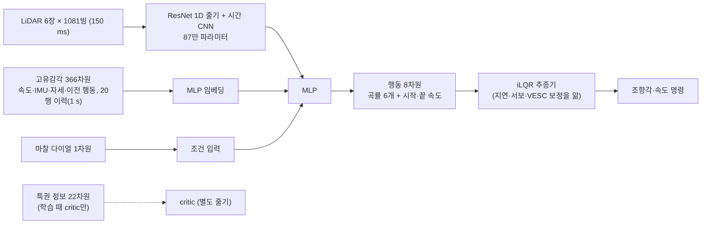

# 왜 이 구조인가, 그리고 PPO가 맞는가 (2026-09-22)

지금 정책(`spec_korea_contact_s911`, 그 연장인 `s912`)의 구조를 구성 요소마다 **왜 그렇게 했는지**,
**그 이유를 뒷받침하는 측정이 있는지**로 나눠 정리한다. 이어서 학습 알고리즘(PPO)의 병목을 로그로
재고, 대안을 비교한다. 새 실험은 하지 않았다. 근거는 체크포인트 메타데이터, 코드, 커밋 메시지,
기존 연구 노트, s911/s912 학습 로그, 이번 주 평가(`eval911`)이다.

## 판정

* **요구사항에서 곧바로 나오는 구성은 근거가 강하다.** 지도·위치 없이 센서만 받는 입력, 학습 때만
  특권 정보를 보는 비대칭 critic.
* **설계 논리는 좋지만 "이것이어야만 한다"는 측정은 없다.** 경로(plan) 출력 + iLQR 추종기, 스캔
  6장 묶음, ResNet 1D 줄기. 대안과 같은 데이터·같은 평가로 바꿔 본 실험이 없다.
* **지금 구조 설명에서 빼야 할 것이 있다.** grip·opp 보조 헤드는 s911/s912에서 손실 가중치가
  0이다(`--aux-grip 0`, `--aux-opp 0`). 헤드는 체크포인트 계보에 딸려 온 것일 뿐 학습에
  참여하지 않는다. 켜서 시험했을 때도 이득의 근거가 없었다(아래 2.7).
* **PPO가 막힌 이유는 알고리즘 이름보다 두 가지 측정값이다.** 업데이트 한 번에 충돌이
  3.4~3.5회뿐이고, KL 고정이 꺼진 채 학습률이 고정이다. 앞의 것은 경험 재사용(SAC 계열)이
  근본적으로 풀고, 뒤의 것은 옵션 두 개로 풀린다. 싼 것부터 한다.

## 1. 현재 구조 (s911 체크포인트에서 읽은 값)

| 항목 | 값 | 출처 |
|---|---|---|
| 파라미터 | 2 251 541 (actor 줄기 870 400, critic 줄기 870 400) | `ppo_final.pt` state_dict |
| 스캔 | 6장, stride 1, 1081빔, 최대 10 m | `meta.n_stack`, `spec.scan_stack` |
| 고유감각 | 366차원, 이력 20행 × stride 2 | `meta.proprio_dim`, `spec.hist_len` |
| 행동 | 8 = 곡률 6개(경로 길이에 고르게) + `v_start`, `v_end` | `mpc.N_KNOTS = 6`, `mpc.decode` |
| 경로 길이 | 속도 × 1.5 s, 2~15 m로 제한 | `PlanSpec.horizon_s/len_min/len_max` |
| 곡률 범위 | ±1.6 1/m (최대 조향 반경 약 0.74 m) | `PlanSpec.kappa_max` |
| critic 특권 입력 | 22차원 | `meta.priv_dim` |
| 조건 입력 | 현재 마찰 `(mu − 1)/0.25`, 다이얼로 학습 | `meta.cond` |
| 보조 헤드 | grip(1), opp(3) — **s911/s912에서 가중치 0** | `model.py:260,267`, `ppo.py --aux-grip/--aux-opp` 기본 0 |

## 2. 구성 요소별 근거

각 항목은 "왜 했나 → 무엇이 뒷받침하나 → 근거의 강도 → 무엇이 이 선택을 뒤집을 수 있나" 순서다.

### 2.1 지도·위치 없이 센서만 입력 — 강함

* **왜:** 목표가 "지도·전역 위치추정에 의존하지 않는 actor가 처음 보는 트랙에서 주행"이다
  ([algorithm_assessment.md](../algorithm_assessment.md) 첫 줄).
* **근거:** 요구사항 자체. 측정으로 정당화할 대상이 아니다.
* **뒤집는 조건:** 대회가 사전 지도를 허용하고 그쪽이 확연히 빠르다면 목표를 다시 정해야 한다.
  구조의 문제가 아니라 목표의 문제다.

### 2.2 경로 출력 + iLQR 추종기 — 설계 논리 강함, 비교 측정 없음

* **왜 (도입 커밋 `34f718d`, `10be8f9`, 2026-09-07):**
  1. 추종기가 보정된 지연, 서보 오프셋·게인, VESC 속도 게인을 안다. 신경망은 차마다 다른
     보정을 배울 필요가 없고, 그립만 모른다.
  2. 경로는 사람이 보고 검사할 수 있다. 계획 여유(plan clearance) 보상, 경로 기반 안전 필터,
     콘솔 표시가 모두 여기에 기대고 있다.
  3. teacher 라벨을 만들기 쉽다. 레이싱 라인에서 곡률을 바로 뽑는다.
  4. 곡률 knot은 헤어핀을 큰 곡률 하나로 표현한다. 이전의 오프셋 표현은 레이싱 라인에서 최대
     0.8 m 벗어났다(`10be8f9`).
* **간접 근거:**
  * 같은 시연 데이터로 공개된 직접 조향 구조 두 개를 다시 학습한 비교
    ([baselines-2026-09-15.md](baselines-2026-09-15.md) Table 3). 단독 주행 성공이
    TinyLidarNet 구조 48/384, End2Race 구조 0/384였다. 우리 정책(A701, 경로 출력)은 217/384다.
    **단, 우리 쪽은 PPO까지 거친 정책이고 같은 데이터로 증류한 학생이 아니다.** 그 문서도 이
    줄을 통제된 비교라고 부르지 않는다.
  * 같은 문서의 교통 비교("What survives traffic" 절)에서, 교통 속 성공률을 단독 성공률로 나눈
    유지율은 가중치를 고정하고 런타임 제어기(arm)만 바꾸면 16.3%p 움직였다. 제어기를 고정하고
    가중치를 바꾸면 4.1%p였다. 추종기 쪽 층이 성능을 크게 좌우한다는 뜻이고, 그 층은 경로 출력이
    있어야 존재한다.
* **약점:**
  * iLQR 비용에는 장애물이 없다. 충돌 회피는 전적으로 신경망이 고른 경로에 달렸다.
  * 후진은 행동 공간에 없어서 추종기에 특수 규칙을 넣었다(`PlanSpec.v_reverse`).
  * 경로 공간에서는 탐색 잡음을 작게 둬야 한다(초기 log_std −1.8, `e77c137`). 탐색이 좁다.
* **뒤집는 조건:** 같은 시연 버퍼로 경로 출력 학생과 직접 조향 학생을 **같은 신경망**으로
  학습해 비교했을 때 직접 조향이 같거나 낫다면, 추종기는 이득 없이 복잡도만 더하는 셈이다.
  `DemoBuffer`가 경로 라벨을 함께 저장하므로 이 비교는 데이터를 다시 모으지 않고도 된다(4장 E1).

### 2.3 스캔 6장 묶음(시간 정보) — 필요성은 측정됨, "6장이 충분한가"는 미정

* **왜:** 스캔 한 장에는 속도가 없다. 상대차가 움직이는지 알려면 여러 장을 비교해야 한다.
* **근거 ([motion-memory-2026-09-14.md](motion-memory-2026-09-14.md) E1):** 정책 표현에서
  가장 가까운 상대차의 종방향 상대 속도(Δv_x)를 선형으로 읽어 낸 R²(중앙값)는 이렇다.
  * 시간 정보 없음: −0.06
  * 6장 묶음: +0.12
  * 학습 안 한 GRU: +0.19
  
  시간 정보는 필요하지만, 6장 묶음으로 얻는 양은 작다.
* **약점:** GRU를 붙인 정책의 주행 비교는 스모크 규모에서 구분되지 않았다
  ([memory-policy-2026-09-13.md](memory-policy-2026-09-13.md)). 144회 중 완주가 순전파 73회,
  GRU 66회로 1 표준오차 안이다. 같은 문서에 따르면 "기억이 돕는다"는 주장은 없고, 실제 예산으로
  돌린 비교도 아직 없다.
* **뒤집는 조건:** 실제 예산(수백만 스텝)에서 GRU나 긴 스캔 묶음이 장애물·교통 평가에서 분명히
  낫다면 바꾼다(E2).

### 2.4 ResNet 1D 줄기 — 일반론만 있음

* **왜:** 빔 각도 방향으로 가중치를 공유하는 합성곱이다. 6 486개 입력을 MLP로 받는 것보다
  싸고, 각도가 조금 달라진 장면에도 일반화하기 쉽다는 일반론이다.
* **근거:** 이 프로젝트에서 `--scan-stem plain`과 `resnet`을 비교한 기록을 찾지 못했다.
* **알려진 약점:** 첫 층이 stride 2의 7탭 합성곱이라, 두 빔 폭의 틈은 한 탭 안에 들어간다
  (memory-policy 노트의 "Why" 절). 상자 사이 좁은 틈을 줄기가 뭉갤 수 있다는 지적이 이미 있다.
* **뒤집는 조건:** plain 줄기나 작은 CNN이 같은 평가에서 같으면, 더 작은 쪽이 실차 추론 예산에
  유리하다(E3).

### 2.5 critic만 특권 정보(비대칭 actor-critic) — 강함

* **왜:** 참 상태·마찰·상대 정보로 가치 추정의 분산을 줄인다. actor는 이것을 보지 않으므로
  배포에 영향이 없다.
* **근거:** 표준 기법(Pinto 외, RSS 2018). 배포 경로가 critic을 쓰지 않는다는 것은 코드로
  보장된다(`learn/export.py`의 `ActorOnly`/`RecurrentActorOnly`가 actor만 ONNX로 내보낸다).
* **비용:** critic 줄기가 actor와 같은 크기(87만)라 학습 계산이 두 배다. 공유 줄기와 비교한
  기록은 없다.

### 2.6 마찰 다이얼 입력 — 중간

* **왜:** 실제 바닥의 마찰은 모르고, actor가 센서 이력으로 스스로 알아내지 못한다. 동결 특징에
  선형 탐침을 걸었을 때 R² 0.07이다(`model.py:250` 주석,
  [mintime-teacher-speed-head-2026-09-19.md](mintime-teacher-speed-head-2026-09-19.md) 201행).
  그래서 운영자가 "얼마나 그립을 쓸지"를 정하게 했다.
* **근거:** 추정이 안 된다는 측정은 있다. 다이얼이 실차에서 맞게 작동한다는 측정은 아직 없다.

### 2.7 grip·opp 보조 헤드 — 현재 비활성, 근거 없음

* **상태:** s911/s912 레시피에 `--aux-grip`, `--aux-opp`가 없고, 기본값은 0이다. 헤드는
  체크포인트에 파라미터로 남아 있을 뿐 손실에 들어가지 않는다. 콘솔도 이 출력을 표시하지 않는다.
* **켰을 때의 기록:**
  * grip: [reward-audit-2026-09-13.md](reward-audit-2026-09-13.md) 54행. SGR 스크린에서
    "+2%p 기준을 넘은 조합 없음, 시드마다 부호가 다름 — 이득의 근거 없음".
  * 상대 미래 예측 헤드: [future-head-2026-09-14.md](future-head-2026-09-14.md). 상대의 0.5초
    뒤 상태를 은닉 상태에서 R² 0.0~0.36으로만 읽을 수 있고, 팔(arm) 사이에 구분이 안 된다.
* **판단:** 구조 설명에서 "보조 헤드로 마찰과 상대 운동을 학습한다"는 문장은 지금 정책에
  해당하지 않는다. 계속 싣고 다닐 이유도, 다시 켤 근거도 없다.

## 3. 학습 알고리즘: PPO의 병목, 측정값으로

| 항목 | s911 | s912 (1240번 업데이트까지) | 출처 |
|---|---|---|---|
| 업데이트당 학습 차량 스텝 | 4 096 (102 s, 0.39 km) | 같음 | `progress.jsonl` |
| 업데이트당 벽·장애물 충돌 | **3.5회** | **3.4회** | `reward/collision_per_step ÷ −8` |
| 시뮬레이터 처리량 | 344 스텝/s | 343 스텝/s | `sps` |
| 학습률 | 5e-5 고정 | 같음 | `contact_run_v2.sh` |
| KL 고정 계수 | **0** (ppo 기본값은 0.3) | 같음 | 레시피 `--kl-coef 0.0` |
| 시작 정책과의 KL | 끝날 때 6.7 | 1024번에서 7.4 | `kl_ref` |

읽는 법:

1. **충돌 신호가 드물다.** 한 업데이트의 기울기를 충돌 3~4회가 정한다. 충돌 회피 쪽 개선이
   잡음에 묻히는 게 당연하다. s912의 충돌/km는 128번 업데이트 단위로 5.1 → 6.5 → 9.2 → 6.8 →
   9.0 → 6.1 → 6.5 → 10.5로 오르내렸다.
2. **데이터가 귀하다.** 초당 343스텝이면 6.3M 스텝에 5시간이다. 이런 상황에서 한 번 쓴 데이터를
   버리는 PPO는 불리하다. 수만 개 환경을 병렬로 돌리는 드론 레이싱(Swift)과는 사정이 다르다.
3. **정책이 떠돈다.** 보상이 평평한 곳(거리 점수는 그립 한계에 막힘)에서 학습률 고정·KL 0으로
   계속 업데이트하니, 좋아지지 않으면서 시작점에서 멀어진다.
4. **그래도 효과는 있었다.** s911은 흔들림 없는 평가에서 s906보다 장애물 충돌이 절반이었다
   (5개 장애물 조건 합산 7.25 → 3.75/km, [eval911](../../../f1sim_runs/_eval/mintime-teacher-2026-09-19/eval911/table.md)는
   저장소 밖). 학습 로그만 보고 판단하면 안 된다.

## 4. 대안

### 4.1 알고리즘

| 방법 | 레이싱 적용 사례 | 우리 병목에 대한 효과 | 비용 |
|---|---|---|---|
| **PPO 보강** (학습률 감소, KL 고정, 어려운 장면 비중↑) | Swift(드론, PPO, 대규모 병렬) | 떠돌기(3번) 해결. 드문 충돌(1번)은 장면 비중으로 일부 | 옵션·작은 코드 |
| **SAC 계열** (SAC, TD3, 분포형 QR-SAC) | GT Sophy(QR-SAC), GT Sport 초인간 주행(SAC), F1TENTH TAL(TD3) | 충돌 전이가 버퍼에 남아 반복 학습됨, 충돌 장면 우선 추출 가능(1·2번) | 새 학습기, critic을 처음부터 |
| **SAC + 시연 섞기** (RLPD) | — (일반 로보틱스) | 우리는 teacher가 있어 초반이 빠름 | 위와 같음 + 시연 버퍼 |
| **모델 기반** (Dreamer 계열) | F1TENTH LiDAR 레이싱(Dreamer, 모델 없는 방법보다 효율·일반화 우세 보고) | 가장 효율적일 수 있음 | 접촉·다차량 장면의 세계 모델이 어려움, 작업량 최대 |

**경험 버퍼의 메모리 (계산값).** 전이 하나를 그대로(fp32) 저장하면 27.5 kB이고, 100만 개면
27.5 GB다. 이 PC의 RAM은 14 GB라 불가능하다. 새로 들어온 스캔 1장만 uint16으로 저장하고(1 mm
해상도) 묶음은 인덱스로 다시 만들면, 고유감각 fp16 포함 3.0 kB이고 100만 개에 3.0 GB다.
uint8(10 m/255 ≈ 4 cm)은 좁은 틈을 뭉개므로 쓰지 않는다.

### 4.2 이 문서의 주장을 확인할 실험

평가는 모두 `scripts/eval_ckpts.sh`로 한다. 조건은 s911 환경 6가지(단독 빈 트랙, 단독+장애물,
상대 4종+장애물), 32대 × 60 s, 시드 77이다. 결과는 `eval912/table.py` 한 표에 들어간다.

| # | 비교 | 무엇을 가리나 | 비용 | 우선 |
|---|---|---|---|---|
| E0 | s912 체크포인트(u128, u768, 최종) 대 s911 | 이어서 학습한 것이 도움이 됐나 | 평가 30분 | 진행 예정 |
| E5 | PPO 보강: 학습률 2e-5→0 코사인, `--kl-coef` 0.05~0.1(기준 s911) | 떠돌기를 막으면 개선이 이어지나 | 학습 1회 | **1** |
| E1 | 같은 시연 버퍼로 경로 학생 대 직접 조향 학생(같은 신경망) | 2.2의 핵심 결정 | 증류 2회(수 시간) | **2** |
| E6 | SAC 계열 파일럿: s911 actor에서 시작, 1M 스텝, 압축 버퍼 | 경험 재사용의 효율 | 학습기 구현 며칠 + 학습 | 3 |
| E2 | GRU 대 스캔 6장, 실제 예산 | 2.3 | 학습 2회 | 4 |
| E3 | plain 줄기 대 ResNet 줄기 | 2.4, 추론 예산 | 학습 2회 | 5 |
| — | 보조 헤드 제거 | 2.7 (행동에는 영향 없음, 정리) | 코드 | 정리 작업 |

## 5. 이번 점검에서 새로 드러난 것

* **보조 헤드는 비활성이다.** 구조 설명과 논문 문장에서 빼야 한다(2.7).
* **KL 고정은 레시피에서 꺼져 있었다.** ppo 기본값 0.3이 교통 확장 레시피 이후 0으로 이어졌고,
  s911과 s912의 떠돌기와 맞물린다(3장).
* **런타임 제어기(arm)가 가중치보다 교통 성능을 크게 좌우한다는 측정이 있다**(2.2). 그런데
  s911/s912는 학습과 평가 모두 `--controller legacy`다. 이 측정은 마찰 다이얼 도입 이전이라,
  다이얼 정책에서 같은지는 다시 재야 한다.
* **경로 출력의 이득은 통제된 비교로 확인된 적이 없다**(2.2). 가장 큰 설계 결정인데 근거가
  설계 논리와 교란된 비교뿐이다.

## 참고 문헌

* P. R. Wurman 외, "Outracing champion Gran Turismo drivers with deep reinforcement learning",
  *Nature* 602, 223–228, 2022. QR-SAC. <https://www.nature.com/articles/s41586-021-04357-7>
* F. Fuchs, Y. Song, E. Kaufmann, D. Scaramuzza, P. Dürr, "Super-Human Performance in Gran Turismo
  Sport Using Deep Reinforcement Learning", *IEEE RA-L* 6(3), 4257–4264, 2021. SAC.
  <https://arxiv.org/abs/2008.07971>
* E. Kaufmann 외, "Champion-level drone racing using deep reinforcement learning", *Nature* 620,
  2023. PPO, 대규모 병렬 시뮬레이션.
* B. D. Evans, H. A. Engelbrecht, H. W. Jordaan, "High-speed autonomous racing using
  trajectory-aided deep reinforcement learning", *IEEE RA-L* 8(9), 5353–5359, 2023. TD3, F1TENTH.
  <https://arxiv.org/abs/2306.07003>
* "Comparing deep reinforcement learning architectures for autonomous racing",
  *Machine Learning with Applications*, 2023.
  <https://www.sciencedirect.com/science/article/pii/S266682702300049X>
* A. Brunnbauer 외, "Latent Imagination Facilitates Zero-Shot Transfer in Autonomous Racing",
  *ICRA* 2022, 7513–7520. Dreamer, F1TENTH LiDAR. <https://arxiv.org/abs/2103.04909>
* P. J. Ball, L. Smith, I. Kostrikov, S. Levine, "Efficient Online Reinforcement Learning with
  Offline Data" (RLPD), *ICML* 2023.
* L. Pinto 외, "Asymmetric Actor Critic for Image-Based Robot Learning", *RSS* 2018.

