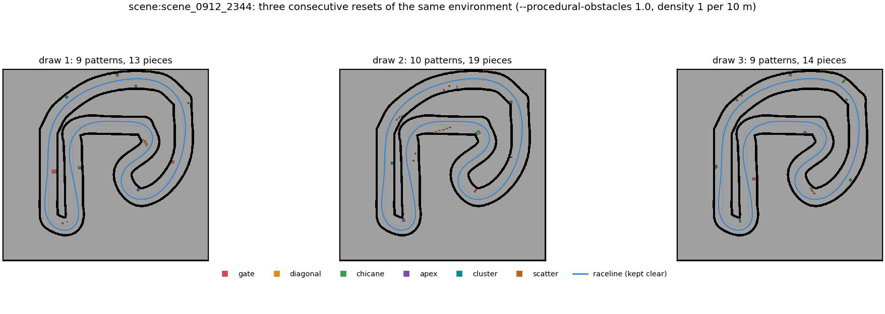
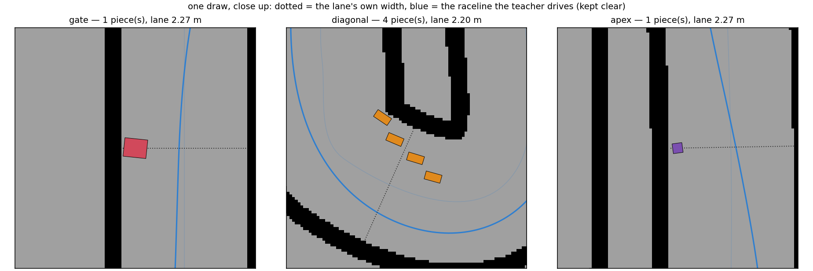

# Obstacles drawn fresh at every reset — 2026-09-13

Branch `feat/procedural-obstacles` (base main `4209ec2`). Code: `f1sim/procedural_obstacles.py`,
`EnvConfig.procedural_*`, `--procedural-obstacles`. Tests: `tests/test_procedural_obstacles.py`.
User-facing description: [training.md](../training.md#obstacle-layouts-redrawn-at-every-reset),
[tracks.md](../tracks.md#obstacles).

## 1. The problem this is aimed at

Every finetune so far improves on the training tracks and not on held-out ones. The mechanism the
held-out proxy shows (root, 2026-09-13 09:00) is not that the policy gets worse at obstacles — it is
that it gets *faster*. Right after the warm start it drives slightly slower on unseen maps and
completes more of them (137/256 at update 8 against the frozen original's 88); as training goes on
its speed returns to the original's (4.13 → 4.23 m/s) and completions fall back to about 100.

The training set is 204 tracks whose obstacle layouts are **fixed**. `+rlobs`, `+obs`, `+pinch` and
`+hard<seed>` are rasterised into the occupancy grid once, at load, and every environment driving
that map for the whole run sees the same boxes in the same places. Speed through a layout can
therefore be learned by knowing the layout, and the progress reward (+4/s,
[reward-audit-2026-09-13](reward-audit-2026-09-13.md)) pays exactly as much for that as for speed
earned by seeing. On an unseen layout the same speed is a collision.

So: the layout has to change at every reset. That rules out the grid — re-rasterising a map and
re-running the erosion connectivity proof per environment per reset is seconds of CPU work for
something that has to happen thousands of times a second, and the grids are shared between
environments precisely so that several hundred fit on one GPU.

## 2. What was built

The same six patterns `hard_obstacles.py` draws — gate, diagonal, chicane, apex, cluster, scatter —
at the same sizes, placed as **props** (`f1sim.props`): convex prisms the LiDAR and the contact test
already handle analytically, with no grid involved. A layout is a pose and a shape index per piece,
so a redraw is a batched gather and a write.

### The pieces

Each piece is one catalogue entry built by `props.build(...)`, reduced to its declared
`Envelope` — "the convex prism the prop occupies", whose `bevel_tolerance` (12–31 mm for these
styles) is the props module's own measured bound on how far it stands outside the drawn surface.
One prism per piece, rather than the four merged height bands a `+props` catalogue prop gets: a
layout of twenty pieces then costs the tracer twenty passes instead of sixty. The looser bound
shows only on the two tapered styles.

25 entries, 16 of them "row" pieces and 9 "small" ones, `k_pad` 8:

| group | styles and sizes |
|---|---|
| row (16) | `cardboard_box` 0.12–0.36 m wide × 0.30 deep, `wooden_crate` 0.24–0.42 × 0.34, `steel_drum` r 0.145, `barrier_block` 0.54 × 0.26, `crate_stack_low` 0.62 × 0.44 |
| small (9) | `cardboard_box` 0.15–0.25 square, `marker_post` r 0.05–0.11 × 0.34 tall, `steel_drum` r 0.11 |

A row takes the largest ladder entry that still fits in what is left of the band, or one of the
three below it, so the widths a row is built from are catalogue sizes rather than arbitrary ones —
which is what makes "the prism is exactly `props.build(...)`'s envelope" checkable by a test.
Effective across-lane extents, yaw jitter included: 0.156, 0.186, 0.216, 0.246, 0.276, 0.281, 0.306,
0.325, 0.336, 0.341, 0.366, 0.396, 0.401, 0.461, 0.571, 0.673 m; the small set runs 0.099–0.280 m,
which is `hard_obstacles`' 0.10–0.25 m.

The drums are built with 8 facets rather than the default 16. The beam tracer pays one
`(B, N, k_pad)` pass per slot and `k_pad` is the widest footprint in the catalogue, so a 16-sided
drum would double what *every* piece costs. Eight facets keeps `k_pad` at 8.

*`scene:scene_0912_2344`, `--procedural-obstacles 1.0 --procedural-density 1.0`, opponents on. Three
consecutive resets of the same environment: the patterns, their kinds, their positions and their
pieces are all redrawn, and the blue racing line the teacher opponents follow is left clear in every
one of them.*

### The gap, by construction

`#hard:*` proves a layout passable *after* drawing it: erode the free space by 0.25 m, check that
the lane before the pattern still connects to the lane after it, undo and redraw when it does not.
That loop is inherently sequential. Here nothing needs proving because nothing can go wrong:

* every piece of a row pattern lies inside a band of width `span` measured from **one** wall, so the
  free lateral space beside it is `lane width − span`;
* `span ≤ width − g` where `g ≥ max(1.2 m, 0.55 × width)` is the drawn gap;
* `width` is the **narrowest** the lane gets anywhere *that* pattern reaches — a forward window of
  0.6 m for a gate, 4.0 m for a chicane whose second row lands 3.5 m later — while the band is
  measured from the wall at each piece's *own* arc index. Both approximations err the same way: the
  realised gap is at least the drawn one;
* a row is truncated at its **inner** end if it runs out of slots, which can only widen the gap;
* a scatter object leaves at least 1.2 m of lane on one side of it, and all the objects of one
  scatter pattern take the same side, so the bound composes.

*The same draw close up. The diagonal's four rungs step across from one wall; what is left is the
far end, and the racing line runs through it.*

Two things this argument does not cover were found by measuring rather than by thinking, and both
are now in the code:

1. **A piece is set square to the tangent at its own index, and the frame turns.** Over the
   0.30–0.44 m a crate is long, a 0.8 m-radius hairpin — and `apex` deliberately looks for the
   sharpest corner in its slice of the lap — rotates the tangent by 0.27 rad, moving a corner up to
   0.09 m across the lane relative to the frame the gap was measured in. `CURVE_INSET = 0.08 m` is
   taken off the band before anything is placed.
2. **Two scatter objects on opposite sides do not compose.** On `control_1400`'s tightest hairpin the
   centerline turns far enough inside 1.4 m of arc that two objects a metre apart *along the lap*
   stand side by side; the widest free run between them was 1.12 m. The side is now drawn per
   pattern rather than per object, which makes the innermost object the binding one and restores
   the bound. Objects still land anywhere from the raceline corridor out to the wall, mid-lane
   included.

**How much of the lap actually gets a pattern.** A pattern whose slice of the lap has nowhere wide
enough is simply not placed — a 1.20 m gap through a 1.42 m lane leaves 0.22 m to block, which is
not an obstacle. Two things keep that rare, and both were added after measuring the first version on
`control_1400` (density 1, so five patterns asked per lap):

| | patterns placed per lap |
|---|---|
| one arc index per pattern, one forward window (4 m) for every kind | 2.83 |
| + eight stratified candidate indices, take one that fits | 3.49 |
| + each kind's own forward reach (0.6 m for a gate, 4.0 m for a chicane) | 3.54 |

The candidate mechanism is the batched equivalent of `hard_obstacles` drawing an index at random and
retrying up to sixty times: the whole placement is worked out at all eight positions and the pattern
takes one where the band comes out wide enough. Every candidate sits inside the pattern's own slice
of the lap, so the 6 m spacing survives the choice.

| map | lap | patterns asked | placed, corridor off | placed, corridor on | `hard_obstacles` places |
|---|---|---|---|---|---|
| `real:blackbox2022_1` | 149.6 m | 15 | 14.9 | 14.1 | 14.0 |
| `scene:scene_0912_2344` | 95.1 m | 10 | 9.4 | 8.7 | 9.4 |
| `gen:control:1400` | 50.9 m | 5 | 3.5 | 3.2 | 4.8 |

(90 environments x 10 redraws; `hard_obstacles` at five seeds.) The two wide maps match the
rasterised draw almost exactly. `control_1400` does not: its lane goes down to 1.42 m, which leaves
0.22 m beside a 1.20 m gap, and `hard_obstacles`' free retry can put two patterns in one wide
stretch where the per-sector scheme here places at most one. That is the price of a placement that
has to be one batched pass, and it is a lower obstacle density on narrow maps rather than a worse
layout on them.

**Measured.** 1000 layouts on the catalogue maps (`real:blackbox2022_1` + `gen:control:1400`,
50 envs x 20 redraws, density 1 per 10 m, no raceline corridor — the harder case, since a corridor
only makes the gap wider). The gap is recovered from the half-planes the LiDAR and the contact test
are actually given, projected onto the centerline frame at three arc samples per piece; a vertex
projection over-states a convex polygon's slice, so this under-states the gap. The measurement is
`test_constructed_gap_on_catalogue_maps`, and it is exactly repeatable — three consecutive runs
return the same three numbers to the digit.

| | layouts ≥ 1.20 m | worst layout | median over blocked arc indices |
|---|---|---|---|
| what ships | **100.0 %** | **1.288 m** | 2.453 m (82 569 indices) |
| with `CURVE_INSET` set to 0 | 100.0 % | 1.205 m | 2.364 m (85 614 indices) |

The second row is the first of the two fixes above, backed out by setting the constant to zero and
re-measuring. It is worth reading carefully: removing the inset does **not** break the bound at this
sample size, it consumes the margin — the worst draw goes from 8.8 cm of slack over the 1.20 m floor
to half a centimetre. That is the honest size of that fix, and it is smaller than an earlier draft of
this note claimed.

The second fix — the scatter side drawn per pattern rather than per object — is structural rather
than a constant, so it is not backed out here. It was found by measuring a 1.12 m worst case during
development, on code that is no longer in the tree; that number is a development observation, not a
result this note reproduces.

### Keeping the teacher opponents out

The contract offered two options. The one that works is the first.

* **Chosen: the gap must contain the raceline corridor.** For every centerline point, the nearest
  raceline point gives the line's lateral offset there; the corridor is that offset widened by the
  car's half-width and `--procedural-raceline-margin` (0.25 m), taken over the 0.8 m of arc one
  piece covers. The pattern-level band is bounded against the corridor at the pattern's own index,
  and then **every piece is separately pushed clear of the corridor at its own index**, or dropped
  if there is no room between the line and the wall. Installed by `F1VecEnv.set_teacher`, so it is
  on exactly when an opponent is driven by the raceline teacher.

  The first cut took the corridor over the pattern's whole 4 m reach, the way the lane width is
  taken, and that is wrong in a way that is invisible until you draw the picture: over 4 m a racing
  line crosses from one side of the lane to the other, so the union of where it has been is most of
  the lane and the band collapsed below `MIN_SPAN` for nearly every pattern. On `control_1400` at
  density 1 it left one or two pieces on a whole lap. The per-piece clamp is both exact and far less
  conservative, and it is only safe because pushing a piece *outward* -- toward the wall it already
  hugs -- keeps it inside the band, so the gap on the other side can only grow.
* **Rejected: widen `clamp_offset` to know about props.** That clamp bounds an *offset away from*
  the raceline when an opponent behaviour event moves a car sideways. It has nothing to say about a
  crate standing on the line itself, which is the case that matters, and the teacher has no
  avoidance behaviour to clamp into.

The cost of the chosen option is worth stating plainly: **with opponents, the gap is always where
the racing line is.** Everything else about the layout still moves at every reset, but a policy
that could already find the racing line would find the gap. With `--race-size 1` there is no teacher
and no corridor.

Tested twice, geometrically and by driving it. Over 144 layouts on two maps the closest any piece
ever comes to the raceline is **0.408 m**, against a car half-width of 0.155 m — the corridor is
0.155 + 0.25, so the clamp is doing exactly what it says. And 16 envs on `gen:control:1400` at
`--race-size 2 --opponent teacher`, layouts on at density 1, driven 200 steps: no teacher-driven car
registers a prop contact at all (`test_no_piece_stands_on_the_raceline`,
`test_teacher_opponents_are_never_routed_through_a_piece`).

### What does not see these props

Everything that reads the occupancy grid or its distance field: the proximity penalty, the plan
clearance penalty, `StepResult.wall_dist` and the privileged vector's `wall_dist` column, the
raceline builder and the teacher's speed profile. The collision test, the LiDAR and the spawn
rejection do see them. That split is deliberate and documented rather than fixed: the grid-based
reward terms price *walls*, and re-deriving a distance field per environment per reset is the thing
this whole design exists to avoid.

## 3. Cost

All on an RTX 4060 Ti **shared with other people's training runs**, `--envs 256`,
`--action-mode plan`, density 1 per 10 m, on `real:blackbox2022_1` (149.6 m, 15 patterns,
**52 prop slots**) + `gen:control:1400` + `scene:scene_0912_2344` — the smoke's own three tracks, so
these are the numbers the smoke pays.

That the card is shared is not a footnote here, it is the reason this section is laid out the way it
is. A measurement taken while somebody else's trainer comes and goes is not a measurement, and the
first attempt at these tables proved it: see the end of this section for what it produced and why it
was thrown away. Every table below is either taken inside a single process, so its rows are
comparable to each other by construction, or run twice in opposite orders so that the drift is
visible instead of silently baked into the answer.

### What it cost before it was made to cost less

The whole of the cost is the two `prop_math` primitives, and the whole of *their* cost was that they
walk their slot dimension in a Python loop of ~20 elementwise ops over `(B, N, k_pad)` tensors:
eagerly that is a kernel launch and a full round trip to memory for each one. Three changes were
made, and the table below measures all four states **back to back in one process against one
environment** (`cost/bench.py`), rather than quoting four numbers taken at four different times on a
shared card. The intermediate states are reconstructed rather than recalled: the eager primitives are
still there as `prop_math.ray_prisms_hits` / `prism_contacts`, and the cull is removed by handing the
contact tests every slot.

| | ms / env step | env-steps/s | vs the flag off |
|---|---|---|---|
| no layouts (the flag off) | 53.03 | 4,827 | 1.00x |
| layouts on, as first written (eager, every slot) | 339.17 | 755 | 6.40x |
| + `torch.compile` on the two `prop_math` primitives | 139.81 | 1,831 | 2.64x |
| + contact tests culled to the 8 nearest slots (**what ships**) | **64.67** | **3,959** | **1.22x** |

(`--envs 256`, `--action-mode plan`, density 1 per 10 m, 52 prop slots, ~20.5 pieces a layout; card
idle at 1.4 GB and never above 2.4 GB for the whole run.) **A full-density layout redrawn at every
reset costs 22 % of the environment step.** Without the two changes in the last two rows it costs 540 %.

`ray_prisms_hits` on its own, ranges and hit masks compared elementwise:

| slots | eager | inductor | speed-up | agreement |
|---|---|---|---|---|
| 16 | 25.94 ms | 0.76 ms | 34x | hit mask identical (0 of 276 736 beams differ); ranges within 1.9 um |
| 52 | 84.40 ms | 3.34 ms | 25x | same |

The agreement column is a correction to an earlier draft of this note, which said "identical". It is
not: fusing the chain reassociates float32 arithmetic and moves a range by up to **1.9 um**, mean
0.15 um. What does *not* move is which beams hit — zero disagreements in the hit mask at either slot
count — so no beam changes what it struck, only the last digits of how far. 1.9 um is four orders of
magnitude under the 1 cm of range noise the sensor model adds on top, and it does not touch the
flag-off path at all (with no props the merge is never called, which is why the pinned byte-identity
digest still holds). It does reach the existing `+props` catalogue tracks, and that is a real if
minute behaviour change on a path this branch did not otherwise mean to touch.

Where the remaining time goes, per step:

| | frac 0.0 | frac 0.5 | frac 1.0 |
|---|---|---|---|
| spawn rejection, at reset | 15.06 | 22.66 | 24.12 |
| LiDAR scan (grid trace + the prop merge) | 10.14 | 23.10 | 23.33 |
| drawing the layout, at reset | 0.00 | 5.67 | 6.31 |
| contact SAT against the props | 2.15 | 3.15 | 3.53 |
| whole step, **as instrumented** | 78.25 | 124.08 | 127.13 |

[ms per step, `--envs 256`, plan mode, zero action — so the cars crash and reset constantly, which is
far more reset work than a trained policy causes.] Read the rows, not the total: every component is
wrapped in a `torch.cuda.synchronize()` to be timed at all, which serialises the step and inflates
it — the same flag-off setting is 53.03 ms uninstrumented against 78.25 ms here. The shape is what
matters, and it is that the beam merge and the spawn rejection are the cost, while the draw itself —
the thing this whole feature is — is about 6 ms, a twentieth of the step.

The contact cull is exact rather than approximate: a prop can only touch a car whose centre is
within the two circumradii (0.71 m here), the eight nearest are kept, and every live slot inside
that reach that the cull dropped is counted. `missed_in_reach` is **0 in every run of every
measurement on this page**, and `dropped_per_layout` — pieces that did not fit the slot budget — is
0 as well. The beams are **not** culled: every slot is traced, which is what keeps the LiDAR
identical to what a `+props` catalogue prop would produce.

**A note on the card.** It is shared with other people's training runs, and that is not a footnote:
the first attempt at this table caught a gap between two foreign jobs and was overrun partway
through by the next one, which produced rows where `--procedural-obstacles 0.5` came out *faster*
than `0.0`. Those rows are in `cost/profile.log` and are not used. Every number on this page is
taken with `nvidia-smi` sampled every 15 s alongside it, and the reading is quoted with it.

### Trainer throughput

The contract asks for trainer throughput at 0 / 0.5 / 1.0 with `--envs 256`. It was run, twice, and
**the honest result is that it does not resolve on this card.** Twelve-update arms, everything else
the smoke recipe:

| | forward pass (ran 00 → 05 → 10) | reverse pass (ran 10 → 05 → 00) |
|---|---|---|
| `--procedural-obstacles 0` | 305 steps/s (1st) | 362 steps/s (3rd) |
| `--procedural-obstacles 0.5` | 291 steps/s (2nd) | 220 steps/s (2nd) |
| `--procedural-obstacles 1.0` | 360 steps/s (3rd) | 328 steps/s (1st) |

The forward pass alone says full density is **118 %** of the flag off — faster with obstacles on,
which cannot be true. The reverse pass says 91 %. The same setting measured twice differs by 19 %,
32 % and 10 % respectively, and the idle GPU reading fell monotonically through the forward pass
(1705 → 1530 → 1201 MiB) as other sessions' jobs drained. **The run-to-run spread for one setting is
larger than the spread between settings**, so six arms of this length on a card other people are
using cannot measure this. Both passes are given in full rather than the flattering three of the six.

What does resolve, because both arms are 128 updates and ran back to back, is the smoke pair at
`--envs 64`:

| | median steps/s (upd 20+) | over the last 33 updates |
|---|---|---|
| `proc_off` | 405 | 489 |
| `proc_on` (full density) | 367 | 380 |

That is a 10–22 % throughput cost depending on the window, consistent with the 22 % single-process
env-step number above and with the fact that the trainer spends time on the update as well as on the
environment. **Take 1.22x on the environment step as the number, and about 10–20 % on end-to-end
trainer throughput.**

## 4. Smoke

**Both arms train.** The contract's recipe — warm start from the frozen original with
`--memory gru --scan-channels memory,edges`, `--action-mode plan`, `real:blackbox2022_1,
gen:control:1400,scene:scene_0912_2344`, `--envs 64 --total 262144`, `--race-size 2 --opponent
mixed`, all four opponent events — run twice, differing only in `--procedural-obstacles 1.0`.
128 of 128 updates each, `rc=0`, on a card whose idle reading was 1.2–1.6 GB at launch
(`smoke/logs/proc_off.log`, `proc_on.log`, and the `.gpu` traces beside them).

| arm | updates | median steps/s (upd 20+) | collisions/km, last 20 updates | lap times appear |
|---|---|---|---|---|
| `proc_off` | 128/128 | 405 | 2.3 – 51 (one 935 outlier) | yes |
| `proc_on` | 128/128 | 367 | 3.5 – 109 | yes, 17.5 s |

`proc_on` starts at 3901 collisions/km on update 1 — a warm-started policy meeting crates it has
never seen — and is down to the tens by the end while completing laps. That is the shape a training
curve should have here, and it is the whole of what a smoke can say about learning.

**The held-out proxy.** Root's checkpoint-selection proxy: eight obstacle maps that neither arm
trained on, 32 envs each, 256 trials, same seed for every arm, `--race-size 1` (so no teacher and no
raceline corridor).

| arm | completions | collisions | coll/km | mean speed | mean lap |
|---|---|---|---|---|---|
| `frozen` (the original, untrained here) | 88/256 | 168 | 21.8 | 4.315 m/s | 9.6 s |
| `proc_off` | 86/256 | 170 | 22.2 | **4.424 m/s** | 9.9 s |
| `proc_on` | **106/256** | 150 | 19.2 | 4.411 m/s | 9.6 s |

Read the speed column first, because it is the mechanism this work was aimed at and the smoke
reproduces it in miniature. `proc_off` did what every finetune does: it got **faster** on unseen maps
(4.315 → 4.424 m/s) and completed **no more** of them (88 → 86). `proc_on` reached essentially the
same speed (4.411 m/s) and completed **twenty more**. Speed that costs completions is speed bought by
knowing the layout; speed that does not is speed bought by seeing it.

**How much to believe it.** Not much on its own, and the number is worth stating rather than
implying: `proc_on` against `proc_off` on completions is z = +1.83 (p ≈ 0.07 two-sided), and against
the frozen original z = +1.64. That is suggestive and not significant at any conventional threshold.
Per track it is a real spread rather than one map carrying the result — `real:map12x16+hard3` goes
2 → 9 → 17 of 32 and `real:map16x07` 18 → 11 → 17, while `real:korea_2025_iccas+hard5` runs the other
way (17 → 23 → 21) and both `scene_0912_2355` variants are near zero for everyone. A 262 144-step
smoke on three tracks cannot settle whether redrawn layouts close the held-out gap. What it does
settle is that the recipe trains, that the flag changes what the policy learns rather than only what
it costs, and that the change is in the direction the mechanism predicts.

## 5. Deviations from `hard_obstacles.py`

| | `hard_obstacles` | here | why |
|---|---|---|---|
| passability | erosion + connectivity proof, redraw on failure | constructive gap, nothing to redraw | the proof loop cannot be batched |
| obstacle | cells in `occupancy` and `tall` | a convex prism | a grid cannot be redrawn per env per reset |
| gap position | anywhere the proof allows | must contain the raceline corridor when a teacher is installed | the teacher cannot see a prop |
| pieces per pattern | as many as the row needs | at most 6, truncated at the inner end | a static shape, and truncation only widens the gap |
| scatter along the lane | `U(0, 3)` per object | stratified, `q + U(0, 0.5)` | two objects at one arc index left a 1.12 m gap |
| scatter side | per object | per pattern | same |
| row piece widths | any | a ladder of catalogue sizes, largest that fits | the prisms come from `props.build`, so the sizes are the ones that were built |
| piece yaw | axis-aligned to the lane | ±0.12 rad, and every across-lane extent is inflated by it before the gap arithmetic | a box set down by hand is not surveyed |
| where a pattern goes | a random index, retried up to 60 times until it fits | one pattern per sector of the lap, at whichever of 8 stratified positions in that sector fits | retry is sequential; the sector keeps the 6 m spacing without a search |
| drum facets | (no drums) | 8 | `k_pad` is the widest footprint and every slot pays for it |
